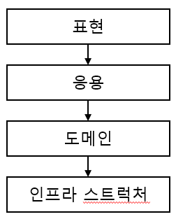
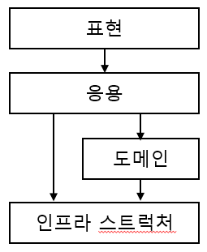
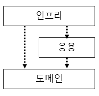

# 02. 아키텍처 개요

## 2.1 네 개의 영역

표현, 응용, 도메인, 인프라스트럭처 는 아키텍처를 설계할때 출현하는 전형적인 영역이다.

표현 영역은 사용자의 요청을 받아 응용 영역에 전달하고 처리 결과를 사용자에게 보여준다.  
많이 사용하는 스프링 MVC 프레임워크가 표현 영역을 위한 기술이다.    
사용자의 요청을 해석하여 응용 영역에 전달후 실행 결과를 사용자가 이해할수 있는 형식으로 변환하여 응답한다.

응용 영역은 시스템이 사용자에게 제공해야할 기능을 구현한다.  
이때 기능 구현을 위해 도메인 영역의 도메인 모델을 사용한다.  
로직을 직접 수행하기 보다는 도메인 모델에 로직 수행을 위임한다.

인프라스트럭처 영역은 구현 기술에 대한것을 다룬다.  
RDBMS, 메세징큐, MongoDB ,REDIS 연동을 처리한다.  
논리적인 개념보다는 실제 구현을 다룬다.

도메인 영역, 응용 영역, 포현 영역은 구현 기술을 사용한 코드를 직접 만들지 않는다.  
대신 인프라스트럭처 영역에서 제공하는 기능을 사용해 필요한 기능을 개발한다.

## 2.2 계층 구조 아키텍처

도메인 복잡도에 따라 응용과 도메인을 분리하기도 합치기도 하지만  
전체적인 아키텍처는 하단과 같은 계층 구조를 따른다.

계층 구조는 그 특성상 하위 계층으로만 의존이 존재한다.

구현의 편리함을 위해 계층구조를 유연하게 적용하기도한다.  
에를 들어 응용 계층은 바로 아래 도메인 계층에 의존하지만 외부 시스템 연동을 위해  
더 아래 인프라스트럭처 계층에 의존하기도 한다.

하지만 인프라스트럭처에 의존하면 "테스트 어려움" 과 "기능 확장의 어려움" 문제 두가지가 발생한다.   
이런 문제는 DIP 를 적용하여 해결할 수 있다.

## 2.3 DIP

DIP(Dependency Inversion Principle) 는 저수준 모듈이 고수준 모듈에 의존하도록 하는것이며  
그 비밀은 추상화한 인터페이스에 있다.

여기서 말하는 의존이라는 상속(extends) 또는 실체화(implements)를 통한 의존을 말한다.

이렇게될 경우 실제 저수준 모듈이 변경되더라도 고수준 모듈 수정없이 저수준 구현 객체 생성 코드만 변경하면된다. 

저수준 모듈에 직접 의존했다면 실제 해당 모듈이 만들어지기전까지 테스트를 할 수 없지만  
DIP 가 지켜질 경우 대역 객체를 사용해 테스트를 할 수 있다.

### 2.3.1 DIP 주의사항

DIP 를 잘못 생각하면 단순히 인터페이스와 구현 클래스를 분리하는 정도로 받아들일 수 있다.

DIP 의 핵심은 고수준 모듈이 저수준 모듈에 의존하지 않도록 하기 위함이므로  
저수준 모듈에서 인터페이스만 추출한다고 DIP 가 될 수 없다.

DIP 를 적용할 때 하위 기능을 추상화한 인터페이스는 고수준 모듈 관점에서 도출한다.

### 2.3.2 DIP 와 아키텍처

인프라 스트럭처 계층이 가장 하단에 위치하는 계층형 구조와 달리 아키텍처에  
DIP 를 적용하면 인프라스트럭처 영역이 응용 영역과 도메인 영역에 의존(상속)하는 구조가 된다.

그러므로 도메인과 응용 영역에 대한 영향을 최소화하여 구현 기술(인프라스트럭처)을 변경하는 것이 가능하다.

DIP 를 항상 적용할 필요는 없다.  
구현 기술에 따라 의존적인 코드를 도메인에 일부 포함하는것이 효과적일때도 있다.  

무조건 DIP 를 적용하려 시도하지 말고 DIP 의 이점을 얻는 수준에서 적용 범위를 검토해보자.

## 2.4 도메인 영역의 주요 구성요소

### 2.4.1 엔티티와 밸류

### 2.4.2 애그리거트

### 2.4.3 리포티터리

## 2.5 요청 처리 흐름

## 2.6 인프라스트럭처 개요

## 2.7 모듈 구성
