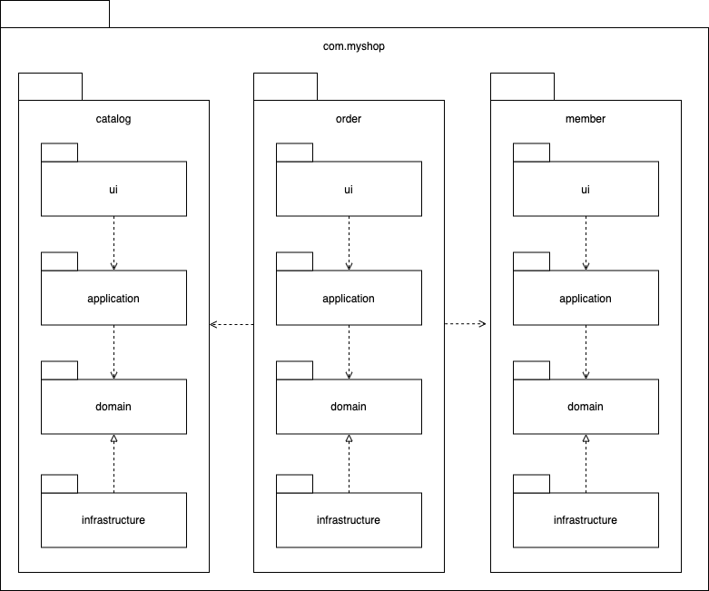
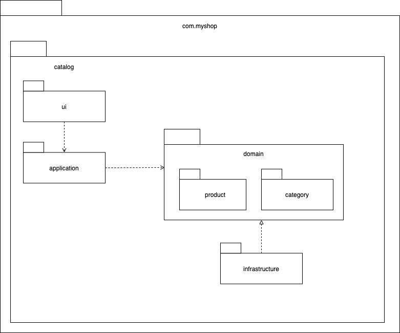

# 02. 아키텍처 개요

## 2.1 네 개의 영역

표현, 응용, 도메인, 인프라스트럭처 는 아키텍처를 설계할때 출현하는 전형적인 영역이다.

표현 영역은 사용자의 요청을 받아 응용 영역에 전달하고 처리 결과를 사용자에게 보여준다.  
많이 사용하는 스프링 MVC 프레임워크가 표현 영역을 위한 기술이다.    
사용자의 요청을 해석하여 응용 영역에 전달후 실행 결과를 사용자가 이해할수 있는 형식으로 변환하여 응답한다.

응용 영역은 시스템이 사용자에게 제공해야할 기능을 구현한다.  
이때 기능 구현을 위해 도메인 영역의 도메인 모델을 사용한다.  
로직을 직접 수행하기 보다는 도메인 모델에 로직 수행을 위임한다.

인프라스트럭처 영역은 구현 기술에 대한것을 다룬다.  
RDBMS, 메세징큐, MongoDB ,REDIS 연동을 처리한다.  
논리적인 개념보다는 실제 구현을 다룬다.

도메인 영역, 응용 영역, 표현 영역은 구현 기술을 사용한 코드를 직접 만들지 않는다.  
대신 인프라스트럭처 영역에서 제공하는 기능을 사용해 필요한 기능을 개발한다.

## 2.2 계층 구조 아키텍처

도메인 복잡도에 따라 응용과 도메인을 분리하기도 합치기도 하지만  
전체적인 아키텍처는 하단과 같은 계층 구조를 따른다.

계층 구조는 그 특성상 하위 계층으로만 의존이 존재한다.

구현의 편리함을 위해 계층구조를 유연하게 적용하기도한다.  
에를 들어 응용 계층은 바로 아래 도메인 계층에 의존하지만 외부 시스템 연동을 위해  
더 아래 인프라스트럭처 계층에 의존하기도 한다.

하지만 인프라스트럭처에 의존하면 "테스트 어려움" 과 "기능 확장의 어려움" 문제 두가지가 발생한다.   
이런 문제는 DIP 를 적용하여 해결할 수 있다.

## 2.3 DIP

DIP(Dependency Inversion Principle) 는 저수준 모듈이 고수준 모듈에 의존하도록 하는것이며  
그 비밀은 추상화한 인터페이스에 있다.

여기서 말하는 의존이라는 상속(extends) 또는 실체화(implements)를 통한 의존을 말한다.

이렇게될 경우 실제 저수준 모듈이 변경되더라도 고수준 모듈 수정없이 저수준 구현 객체 생성 코드만 변경하면된다. 

저수준 모듈에 직접 의존했다면 실제 해당 모듈이 만들어지기전까지 테스트를 할 수 없지만  
DIP 가 지켜질 경우 대역 객체를 사용해 테스트를 할 수 있다.

### 2.3.1 DIP 주의사항

DIP 를 잘못 생각하면 단순히 인터페이스와 구현 클래스를 분리하는 정도로 받아들일 수 있다.

DIP 의 핵심은 고수준 모듈이 저수준 모듈에 의존하지 않도록 하기 위함이므로  
저수준 모듈에서 인터페이스만 추출한다고 DIP 가 될 수 없다.

DIP 를 적용할 때 하위 기능을 추상화한 인터페이스는 고수준 모듈 관점에서 도출한다.

### 2.3.2 DIP 와 아키텍처

인프라 스트럭처 계층이 가장 하단에 위치하는 계층형 구조와 달리 아키텍처에  
DIP 를 적용하면 인프라스트럭처 영역이 응용 영역과 도메인 영역에 의존(상속)하는 구조가 된다.

그러므로 도메인과 응용 영역에 대한 영향을 최소화하여 구현 기술(인프라스트럭처)을 변경하는 것이 가능하다.

DIP 를 항상 적용할 필요는 없다.  
구현 기술에 따라 의존적인 코드를 도메인에 일부 포함하는것이 효과적일때도 있다.  

무조건 DIP 를 적용하려 시도하지 말고 DIP 의 이점을 얻는 수준에서 적용 범위를 검토해보자.

## 2.4 도메인 영역의 주요 구성요소

| 요소                | 설명                                                                                                         |
|-------------------|------------------------------------------------------------------------------------------------------------|
| 엔티티(Entity)       | 고유의 식별자를 갖는 개체로 자신의 라이프사이클을 갖는다.  도메인의 고유한 개념을 표현하고 도메인 모델의 데이터를 포함하여 해당 데이터와 관련된 기능을 함께 제공한다.         |
| 밸류(Value)         | 고유의 식별자를 갖지 않는 객체로 주로 개념적으로 하나인 도메인 객체의 속성을 표현할 때 사용한다.  엔티티의 속성으로 사용될 뿐만 아니라 다른 밸류 타입의 속성으로 사용될 수 있다. |
| 애그리거트(Aggregate)  | 관련된 엔티티와 밸류 객체를 개념적으로 묶은 것.                                                                                |
| 리포지터리(Repository) | 도메인 모델의 영속성을 처리.(엔티티 객체를 로딩하거나 저장하는 기능 같은 것)                                                               |
| 도메인 서비스           | 특정 엔티티에 속하지 않은 도메인 로직을 제공한다.                                                                               |

### 2.4.1 엔티티와 밸류

도메인 모델의 엔티티와 DB 테이블의 엔티티와는 다르다. 

가장 큰 차이점은 도메인 모델의 엔티티는 데이터와 함께 도메인 기능을 함께 제공한다는 점이다.  

도메인 모델의 엔티티는 단순히 데이터를 담고있는 구조라기보단 기능을 함께 제공하는 객체이다.  
도메인관점에서 기능을 구현하고 기능 구현을 캡슐화해서 데이터가 임의로 변경되는것을 막는다.

도메인 모델의 엔티티는 2개 이상의 데이터가 개념적으로 하나인 경우 밸류 타입을 이용해서 표현할 수 있다.

밸류는 불변으로 구현하는 것을 권장하는데 이는 엔티티의 밸류 타입 데이터를 변경할 때 객체 자체를 완전히 교체한다는 것을 뜻한다.

### 2.4.2 애그리거트

도메인이 커질수록 도메인 모델도 커지면서 많은 엔티티와 밸류가 출현한다.  
이에 따라 복잡도도 증가한다.

이때 전체 구조가아닌 한개 엔티티와 밸류에만 집중하는 상황이 발생하며  
상위 수준에서 모델을 관리하지 않을 경우 큰수준에서 모델을 이해하지 못해  
큰 틀에서 모델을 관리할 수 없는 상황에 빠질 수 있다.

도메인 모델에서 전체 구조를 이해하는데 도움되는것이 애그리거트이다.  
애그리거트는 관련 객체를 하나로 묶은 군집이다.

애그리거트를 사용하면 개별 객체가 아닌 관련 객체를 묶어서 객체 군집단위로  
모델을 바라볼수 있게 된다.

애그리거트는 군집에 속한 객체들을 관리하는 루트 엔티티를 갖는다.   

루트 엔티티는 애그리거트에 속해 있는 엔티티와 밸류 객체를 이용해서 애그리거트가 구현해야할 기능을 제공한다.   
이때 애그리거트 루트를 통해서 간접적으로 애그리거트 내의 다른 엔티티나 밸류 객체에 접근할 수 있는데   
이는 애그리거트의 내부 구현을 숨겨서 애그리거트 단위로 구현을 캡슐화할 수 있도록 한 것이다.

애그리거트를 어떻게 구성했느냐에 따라 구현이 복잡해지기도 하고 트랜잭션 범위가 달라지기도 한다.

### 2.4.3 리포지터리

물리적인 저장소에 도메인 객체를 보관하기 위한 도메인 모델. 

엔티티, 밸류가 요구사항에서 도출되는 도메인 모델이라면 리포지터리는 구현을 위한 도메인 모델이다.

리포지터리는 애그리거트 단위로 도메인 객체를 저장하고 조회하는 기능을 저장한다.

도메인 모델을 사용해야 하는 코드는 리포지터리를 통해서 도메인 객체를 구한뒤  
도메인 객체의 기능을 실행한다.

도메인모델 관점에서 Repository 는 도메인 객체 영속화를 기능을 추상화 한것으로 고수준 모듈에 속한다.  
기반 기술을 이용해 Repository 를 구현한 클래스는 저수준 모듈로 인프라스트럭처 영역에 속한다.

응용 서비스와 리포지터리는 밀접한 연관이 있는데 이유는 다음과 같다.

- 응용 서비스는 필요한 도메인 객체를 구하거나 저장할 때 리포지터리를 사용한다.
- 응용 서비스는 트랜잭션을 관리하는데, 트랜잭션 처리는 리포지터리 구현 기술에 영향을 받는다.

리포지터리의 사용 주체가 응용 서비스이기 때문에 리포지터리는 응용 서비스가 필요로 하는 메서드를 제공한다.   
가장 기본이 되는 메서드는 다음과 같다.

- 애그리거트를 저장하는 메서드
- 애그리거트 루트 식별자로 애그리거트를 조회하는 메서드

## 2.5 요청 처리 흐름

사용자가 애플리케이션에 기능 실행을 요청하면 그 요청을 처음 받는 영역은 표현 영역이다.
(스프링 MVC 라면 컨트롤러가 요청을 받아 처리)

표현 영역은 사용자가 전송한 데이터 형식이 올바른지 검사하고 문제가 없다면 데이터를 이용해서 응용 서비스에 기능 실행을 위임한다.  
이때 표현 영역은 사용자가 전송한 데이터를 응용 서비스가 요구하는 형식으로 변환해서 전달한다.

응용 서비스는 도메인 모델을 이용해서 기능을 구현한다.  
도메인 객체를 리포지터리에서 가져오거나 신규 도메인 객체를 생성해서 리포지터리에 저장한다.  
도메인의 상태를 변경하므로 트랜잭션을 관리해야한다.

## 2.6 인프라스트럭처 개요

인프라스트럭처는 표현, 응용, 도메인 영역을 지원한다.   

도메인 객체의 영속성처리, 트랜잭션, REST 클라이언트 등  
다른 영역에서 필요로 하는 프레임워크, 구현 기술, 보조 기능을 지원한다.

도메인 영역과 응용 영역에서 인프라스트럭처의 기능을 직접 사용하는것보다  
이 두 영역에서 정의한 인터페이스를 인프라스트럭처 영역에서 구현하는것이  
시스템을 더 유연하고 테스트하기 쉽게 만들어준다.

하지만 무조건 인프라에 대한 의존을 없애는 것이 좋은 것은 아니다.   
의존을 완전히 갖지 않도록 하다가 구현을 더 복잡하고 어렵게 만들 수 있기 때문이다.  
(스프링의 @Transactional, JPA @Entity @Table 어노테이션 등)

표현 영역은 항상 인프라스트럭처 영역과 쌍을 이룬다.

## 2.7 모듈 구성

아키텍처의 각 영역은 별도 패키지에 위치한다.

도메인이 크면 하위 도메인으로 나누고 각 하위 도메인마다 별도 패키지를 구성한다.   

도메인 모듈은 도메인에 속한 애그리거트를 기준으로 다시 패키지를 구성한다.  
그리고 각 애그리거트와 모델, 리포지터리는 같은 패키지에 위치시킨다.  
도메인이 복잡하면 도메인 모델과 도메인 서비를 별도 패키지에 위치시킬수도 있다.

응용 서비스도 도메인별로 패키지를 구분할 수 있다.

모듈 구조를 얼마나 세분화해야 하는지에 대해 정해진 규칙은 없다.   
단지, 한 패키지에 너무 많은 타입이 몰려서 코드를 찾을 때 불편한 정도만 아니면 된다. 
