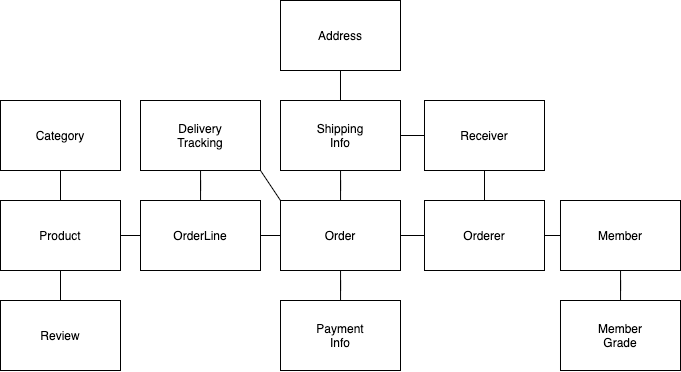
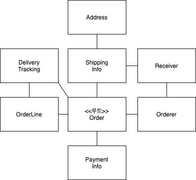

# 03. 애그리거트

## 3.1 애그리거트

주요 도메인 요소 간의 관계를 파악하기 어렵다는 것은 곧 코드를 변경하고 확장하는 것이 어려워진다는 것을 의미한다.

상위 수준 모델을 이해해야 전체 모델을 망가뜨리지 않으면서 추가 요구사항을 모델에 반영할 수 있는데  
세부적인 모델만 이해할 경우 코드변경을 최대한 회피하는 쪽으로 요구사항을 협의하게 된다.



개별 객체 수준에서 모델을 바라보면 상위 수준에서 관계를 파악하기 어렵다.

복잡한 도메인을 이해하고 관리하기 쉬운 단위로 만들려면 상위 수준에서 모델을  
조망할 수 있는 방법이 필요한데, 그 방법이 바로 애그리거트이다.


애그리거트는 복잡한 모델을 관리하는 기준을 제공한다.

한 애그리거트에 속한 객체는 다른 애그리거트에 속하지 않는다.   
애그리거트는 독립된 객체 군이며, 각 애그리거트는 자기 자신을 관리할 뿐 다른 애그리거트를 관리하지 않는다.

경계를 설정할 때 기본이 되는 것은 도메인 규칙과 요구사항이다. 

도메인 규칙에 따라 함께 생성되는 구성요소는 한 애그리거트에 속할 가능성이 높다. 

조심해야할 것은 'A가 B를 갖는다'로 해석할 수 있는 요구사항이 있다고 하더라도   
이것은 반드시 A와 B가 한 애그리거트에 속한다는 것을 의미하는 것은 아니다. 

좋은 예가 상품과 리뷰다.   

- 함께 생성되지 않고 함께 변경되지도 않는다.
- Product 를 변경하는 주체가 상품 담당자라면 Review 를 생성하고 변경하는 주체는 고객이다.

처음 도메인 모델을 만들기 시작하면 큰 애그리거트로 보이는 것들이 많지만 도메인에 대한  
경험이 생기고 도메인 규칙을 제대로 이해할수록 실제 애그리거트의 크기는 줄어들게 된다.  
(저자의 경우 다수의 애그리거트가 한 개의 엔티티만 갖는 경우가 많았다고 한다.)

## 3.2 애그리거트 루트

애그리거트는 여러 객체로 구성되기 때문에 한 객체만 상태가 정상이어서는 안된다.  

도메인 규칙을 지키려면 애그리거트에 속한 모든 객체가 정상 상태를 가져야 한다.

애그리거트에 속한 모든 객체가 일관된 상태를 유지하려면 애그리거트 전체를 관리할  
주체가 필요한데 이 책임을 지는 것이 바로 애그리거트의 루트 엔티티이다.



주문 애그리거트의 루트는 Order 이다.

### 3.2.1 도메인 규칙과 일관성

애그리거트 루트의 핵심 역할은 애그리거트의 일관성이 깨지지 않도록 하는 것이다.  
이를 위해 애그리거트 루트는 애그리거트가 제공해야 할 도메인 기능을 구현한다. 

애그리거트 루트가 제공하는 메서드는 도메인 규칙에 따라 애그리거트에 속한 객체의 일관성이 깨지지 않도록 구현해야 한다.

애그리거트 루트가 아닌 다른 객체가 애그리거트에 속한 객체를 직접 변경하면 안된다.  
이는 애그리거트 루트가 강제하는 규칙을 적용할 수 없어 모델의 일관성을 깨는 원인이 된다.

```java
ShippingInfo si = order.getShippingInfo();
si.setAddress(newAddress);
```

이는 주문 상태에 상관없이 배송지 주소를 변경할 수 있는데 이는 업무 규칙을 무시하고   
DB 테이블에서 직접 데이터를 수정하는 것과 같은 결과를 만든다.  
즉, 논리적인 데이터 일관성이 깨지게 되는 것이다.

불필요한 중복을 피하고 애그리거트 루트를 통해서만 도메인 로직을 구현하게 만들려면   
도메인 모델에 대해 다음의 두 가지를 습관적으로 적용해야 한다.

- 단순히 필드를 변경하는 set 메서드를 공개(public) 범위로 만들지 않는다.
- 밸류 타입은 불변으로 구현한다.

공개 set 메서드는 중요 도메인의 의미나 의도를 표현하지 못하고 도메인 로직이  
도메인 객체가 아닌 응용 영역이나 표현 영역으로 분산되게 만드는 원인이 된다.

밸류 객체의 값을 변경할 수 없으면 애그리거트 루트에서 밸류 객체를 구해도 값을   
변경할 수 없기 때문에 애그리거트 외부에서 밸류 객체의 상태를 변경할 수 없게 된다.

밸류 객체가 불변이면 밸류 객체의 값을 변경하는 방법은 새로운 밸류 객체를 할당하는 것뿐이다.

밸류 타입의 내부 상태를 변경할면 애그리거트 루트를 통해서만 가능하므로  
애그리거트 루트가 도메인 규칙을 잘 유지한다면 전체 일관성을 올바르게 유지할 수 있다.

### 3.2.2 애그리거트 루트의 기능 구현

애그리거트 루트는 애그리거트 내부의 다른 객체를 조합해서 기능을 완성한다.

애그리거트 루트가 구성요소의 상태만 참조하는것은 아니다.  
기능 실행을 위임하기도 한다.

애그리거트 루트가 관리하는 도메인을 구할수 있는 메서드를 제공할 경우  
외부에서 해당 도메인에 기능을 실행해 일관성이 깨질수 있다.

protected 범위로 한정해서 외부에서 실행할 수 없도록 제한하는 방법도 있다.

### 3.2.3 트랜잭션 범위

## 3.3 리포지터리와 애그리거트

## 3.4 ID를 활용한 애그리거트 참조

### 3.4.1 ID를 이용한 참조와 조회 성능

## 3.5 애그리거트 간 집합 연관

## 3.6 애그리거트를 팩토리로 사용하기
