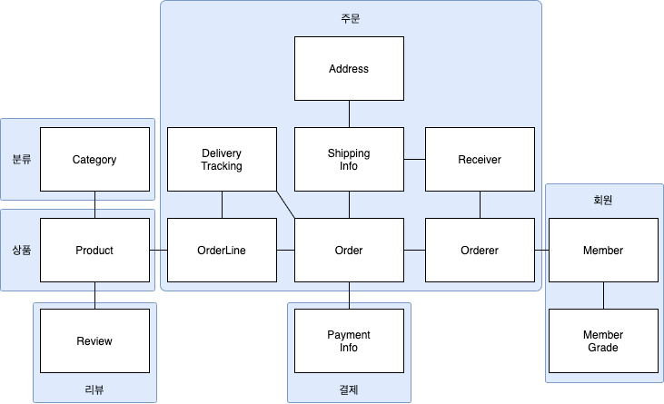

# 03. 애그리거트

## 3.1 애그리거트

주요 도메인 요소 간의 관계를 파악하기 어렵다는 것은 곧 코드를 변경하고 확장하는 것이 어려워진다는 것을 의미한다.

상위 수준 모델을 이해해야 전체 모델을 망가뜨리지 않으면서 추가 요구사항을 모델에 반영할 수 있는데  
세부적인 모델만 이해할 경우 코드변경을 최대한 회피하는 쪽으로 요구사항을 협의하게 된다.


개별 객체 수준에서 모델을 바라보면 상위 수준에서 관계를 파악하기 어렵다.

복잡한 도메인을 이해하고 관리하기 쉬운 단위로 만들려면 상위 수준에서 모델을  
조망할 수 있는 방법이 필요한데, 그 방법이 바로 애그리거트이다.



애그리거트는 복잡한 모델을 관리하는 기준을 제공한다.

한 애그리거트에 속한 객체는 다른 애그리거트에 속하지 않는다.   
애그리거트는 독립된 객체 군이며, 각 애그리거트는 자기 자신을 관리할 뿐 다른 애그리거트를 관리하지 않는다.

경계를 설정할 때 기본이 되는 것은 도메인 규칙과 요구사항이다. 

도메인 규칙에 따라 함께 생성되는 구성요소는 한 애그리거트에 속할 가능성이 높다. 

조심해야할 것은 'A가 B를 갖는다'로 해석할 수 있는 요구사항이 있다고 하더라도   
이것은 반드시 A와 B가 한 애그리거트에 속한다는 것을 의미하는 것은 아니다. 

좋은 예가 상품과 리뷰다.   

- 함께 생성되지 않고 함께 변경되지도 않는다.
- Product 를 변경하는 주체가 상품 담당자라면 Review 를 생성하고 변경하는 주체는 고객이다.

처음 도메인 모델을 만들기 시작하면 큰 애그리거트로 보이는 것들이 많지만 도메인에 대한  
경험이 생기고 도메인 규칙을 제대로 이해할수록 실제 애그리거트의 크기는 줄어들게 된다.  
(저자의 경우 다수의 애그리거트가 한 개의 엔티티만 갖는 경우가 많았다고 한다.)

## 3.2 애그리거트 루트

애그리거트는 여러 객체로 구성되기 때문에 한 객체만 상태가 정상이어서는 안된다.  

도메인 규칙을 지키려면 애그리거트에 속한 모든 객체가 정상 상태를 가져야 한다.

애그리거트에 속한 모든 객체가 일관된 상태를 유지하려면 애그리거트 전체를 관리할  
주체가 필요한데 이 책임을 지는 것이 바로 애그리거트의 루트 엔티티이다.


주문 애그리거트의 루트는 Order 이다.

### 3.2.1 도메인 규칙과 일관성

애그리거트 루트의 핵심 역할은 애그리거트의 일관성이 깨지지 않도록 하는 것이다.  
이를 위해 애그리거트 루트는 애그리거트가 제공해야 할 도메인 기능을 구현한다. 

애그리거트 루트가 제공하는 메서드는 도메인 규칙에 따라 애그리거트에 속한 객체의 일관성이 깨지지 않도록 구현해야 한다.

애그리거트 루트가 아닌 다른 객체가 애그리거트에 속한 객체를 직접 변경하면 안된다.  
이는 애그리거트 루트가 강제하는 규칙을 적용할 수 없어 모델의 일관성을 깨는 원인이 된다.

```java
ShippingInfo si = order.getShippingInfo();
si.setAddress(newAddress);
```

이는 주문 상태에 상관없이 배송지 주소를 변경할 수 있는데 이는 업무 규칙을 무시하고   
DB 테이블에서 직접 데이터를 수정하는 것과 같은 결과를 만든다.  
즉, 논리적인 데이터 일관성이 깨지게 되는 것이다.

불필요한 중복을 피하고 애그리거트 루트를 통해서만 도메인 로직을 구현하게 만들려면   
도메인 모델에 대해 다음의 두 가지를 습관적으로 적용해야 한다.

- 단순히 필드를 변경하는 set 메서드를 공개(public) 범위로 만들지 않는다.
- 밸류 타입은 불변으로 구현한다.

공개 set 메서드는 중요 도메인의 의미나 의도를 표현하지 못하고 도메인 로직이  
도메인 객체가 아닌 응용 영역이나 표현 영역으로 분산되게 만드는 원인이 된다.

밸류 객체의 값을 변경할 수 없으면 애그리거트 루트에서 밸류 객체를 구해도 값을   
변경할 수 없기 때문에 애그리거트 외부에서 밸류 객체의 상태를 변경할 수 없게 된다.

밸류 객체가 불변이면 밸류 객체의 값을 변경하는 방법은 새로운 밸류 객체를 할당하는 것뿐이다.

밸류 타입의 내부 상태를 변경할면 애그리거트 루트를 통해서만 가능하므로  
애그리거트 루트가 도메인 규칙을 잘 유지한다면 전체 일관성을 올바르게 유지할 수 있다.

### 3.2.2 애그리거트 루트의 기능 구현

애그리거트 루트는 애그리거트 내부의 다른 객체를 조합해서 기능을 완성한다.

애그리거트 루트가 구성요소의 상태만 참조하는것은 아니다.  
기능 실행을 위임하기도 한다.

애그리거트 루트가 관리하는 도메인을 구할수 있는 메서드를 제공할 경우  
외부에서 해당 도메인에 기능을 실행해 일관성이 깨질수 있다.

protected 범위로 한정해서 외부에서 실행할 수 없도록 제한하는 방법도 있다.

### 3.2.3 트랜잭션 범위

트랜잭션 범위는 작을수록 좋다.  

여러개의 테이블을 수정하면 잠금 대상이 더 많아진다는 의미다.

잠금 대상이 많아진다는 것은 그만큼 동시에 처리할 수 있는 트랜잭션 개수가   
줄어든다는 것을 뜻하고 이는 전체적인 성능을 떨어뜨린다.

동일하게 한 트랜잭션에서는 한 개의 애그리거트만 수정해야 한다. 

한 트랜잭션에서 두 개 이상의 애그리거트를 수정하면 트랜잭션 충돌이 발생할 가능성이 더 높아지기  
때문에 한번에 수정하는 애그리거트 개수가 많아질수록 전체 처리량이 떨어지게 된다.

애그리거트는 최대한 독립적이어야 하는데 한 애그리거트가 다른 애그리거트의 기능에 의존하면  
애그리거트 간 결합도가 높아진다.

만약 부득이하게 한 트랜잭션으로 두 개 이상의 애그리거트를 수정해야 한다면   
응용 서비스에서 두 애그리거트를 수정하도록 구현해야 한다.

도메인 이벤트를 사용하면 한 트랜잭션에서 한 개의 애그리거트를 수정하면서도 동기나 비동기로  
다른 애그리거트의 상태를 변경할 수 있는데 이는 10장에서 다룰 예정이다.

한 트랜잭션에서 한 개의 애그리거트를 변경하는 것을 권장하지만 다음의 경우에는 두 개 이상의 애그리거트를 변경하는 것을 고려할 수 있다.

- 팀 표준
  - 조직의 표준에 따라 사용자 유스케이스와 관련된 응용 서비스의 기능을 한 트랜잭션으로 실행해야 하는 경우
- 기술 제약
  - 한 트랜잭션에서 두 개 이상의 애그리거트를 수정하는 대신 도메인 이벤트와 비동기를 사용하는 방식을 사용하는데  
    기술적으로 이벤트 방식을 도입할 수 없는 경우 한 트랜잭션에서 다수의 애그리거트를 수정해서 일관성을 처리해야 한다.
- UI 구현의 편리
  - 운영자의 편리함을 위해 주문 목록 화면에서 여러 주문의 상태를 한 번에 변경하고 싶을 경우

## 3.3 리포지터리와 애그리거트

애그리거트는 개념상 완전한 한 개의 도메인 모델을 표현하므로 객체의 영속성을 처리하는  
리포지터리는 애그리거트 단위로 존재해야 한다.

애그리거트는 개념적으로 하나이므로 리포지터리는 애그리거트 전체를 저장소에 영속화해야 한다

애그리거트를 구하는 리포지터리 메서드는 완전한 애그리거트를 제공해야한다.  
그러지 않을 경우 기능 실행 도중 NPE 와 같은 문제가 발생할 수 있다.

영속화할 저장소가 무엇이든지간에 애그리거트 상태가 변경되면 원자적으로 저장소에 반영해야 한다.

## 3.4 ID를 활용한 애그리거트 참조

애그리거트도 다른 애그리거트를 참조 할수 있다.

애그리거트 관리 주체는 애그리거트 루트이므로 애그리거트에서 다른 애그리거트를 참조한다는 것은  
애그리거트 루트를 참조한다는것과 같다.

애그리거트 간의 참조는 필드를 통해 쉽게 구현할 수 있다.   
JPA 를 사용하면 @ManyToOne, @OneToOne 과 같은 애노테이션을 이용해서 연관된 객체를  
로딩하는 기능을 제공하고 있으므로 필드를 이용해서 다른 애그리거트를 쉽게 참조할 수 있다. 

하지만 필드를 이용한 애그리거트 참조는 다음의 문제를 야기할 수 있다.

- 편한 탐색 오용
- 성능에 대한 고민
- 확장 어려움

애그리거트 직접 참조의 가증 큰 문제는 편리함을 오용할 수 있다는 점이다.  
한 애그리거트 내부에서 다른 애그리거트 객체에 접근할 수 있으면 다른 애그리거트의 상태를 쉽게 변경할 수 있게 된다.

하단 코드처럼 구현의 편리함 때문에 다른 애그리거트를 수정하고자 하는 유혹에 빠지기 쉽다.

```java
public class Order {
  private Orderer orderer;

  public void changeShippingInfo(...) {
    // Member의 Address를 변경한다.
    orderer.getCusotmer().changeAddress(newShippingInfo.getAddress());
  }
}
```

한 애그리거트에서 다른 애그리거트의 상태를 변경하는 것은 애그리거트 간의   
의존 결합도를 높여서 결과적으로 애그리거트의 변경을 어렵게 만든다.

두 번째 문제는 애그리거트를 직접 참조하면 성능과 관련된 여러 가지 고민을 해야 한다.   
JPA 를 사용할 경우 참조한 객체를 지연로딩(Lazy)과 즉시로딩(Eager)의 두 가지 방식으로 로딩할 수 있다.

세 번째 문제는 확장이다.   
초기에는 단일 서버에 단일 DBMS 로 서비스를 제공하는것이 가능하다.   
문제는 사용자가 몰리기 시작하면서 도메인별로 시스템을 분리하기 시작한다. 

이 과정에서 하위 도메인마다 서로 다른 DBMS 를 사용할 가능성이 높아진다.  
심지어 하뒤 도메인마다 다른 종류의 데이터 저장소를 사용하기도 한다.

이는 더 이상 다른 애그리거트 루트를 참조하기 위해 JPA 와 같은 단일 기술을 사용할 수 없음을 의미한다.

이런 세 가지 문제를 완호할 때 사용할 수 있는 것이 ID를 이용해서 다른 애그리거트를 참조하는 것이다.

ID 참조를 사용하면 모든 객체가 참조로 연결되지 않고 한 애그리거트에 속한 객체들만 참조로 연결된다.  
이는 애그리거트의 경계를 명확히 하고 애그리거트 간 물리적인 연결을 제거하기 때문에 모델의 복잡도를 낮춰준다.  
또한, 애그리거트 간의 의존을 제거하므로 응집도를 높여주는 효과도 있다.    

참조하는 애그리거트가 필요하면 응용 서비스에서 ID 를 통해 로딩하면 된다.

ID를 이용한 참조 방식을 사용하면 애그리거트에서 다른 애그리거트를 수정하는 문제를 근원적으로 방지할 수 있다.

애그리거트별로 다른 구현 기술을 사용하는 것도 가능해진다.   
또한, 각 도메인을 별도 프로세스로 서비스하도록 구현할 수도 있다.


### 3.4.1 ID를 이용한 참조와 조회 성능

다른 애그리거트를 ID로 참조하면 참조하는 여러 애그리거트를 읽어야 할 때 조회속도가 문제될 수 있다. 

한 DBMS 에 있다면 조인을 이용해 한번에 가져올 수 있음에도 불구하고  
주문마다 상품 정보를 읽어오는 쿼리를 실행하게 된다.

ID를 이용한 애그리거트 참조는 지연로딩과 같이 N+1 조회 문제가 발생한다.  
이는 조회 전용 쿼리 + Projection 을 사용하여 해결하면된다.

애그리거트마다 서로 다른 저장소를 사용하는 경우에는 한 번의 쿼리로 관련 애그리거트를 조회할 수 없다.   
이런 경우 조회 성능을 높이기 위해 캐시를 적용하거나 조회 전용 저장소를 따로 구성한다. 

이 방법은 코드가 복잡해지는 단점이 있지만 시스템의 처리량을 높일 수 있다는 장점이 있다.

## 3.5 애그리거트 간 집합 연관

애그리거트 간 1:N과 M:N 연관에 대해 살펴보자.

개념적으로 존재하는 애그리거트 간의 1:N 연관을 실제 구현에 반영하는것이 요구사항을 충족하는 것과 상관없는 경우가 종종 있다.   
특정 카테고리에 있는 상품 목록을 보여주는 요구사항을 생각해보자.

보통 목록 관련 요구사항은 한번에 다 보여주지 않고 페이징을 통해 나눠서 보여준다.

카테고리쪽에서 1:N 으로 조회하는것이 아닌 상품 입장에서 자신이 속한 카테고리를 N:1 로 연관지어 구하면된다.

M:N 연관은 개념적으로 양쪽 애그리거트에 컬렉션으로 연관을 만든다.   
RDBMS 를 이용해서 M:N 연관을 구현하려면 조인 테이블을 사용한다.

> 다시 한번 말하지만 상세화면과 같은 조회 기능은 조회 전용 모델을 이용해서 구현하는 것이 좋다.

## 3.6 애그리거트를 팩토리로 사용하기

온라인 쇼핑몰에서 고객이 여러 차례 신고를 해서 특정 상점이 더 이상 물건을 등록하지 못하도록 차단한 상태라고 해보자.

```java
public class RegisterProductService {
  public ProductId registerNewProduct(NewProductRequest req) {
    Store store = storeRepository.findById(req.getStoreId());
    checkNull(store);
    if (!store.isBlocked()) {
      throw new StoreBlockedException();
    }
    ProductId id = productRepository.nextId();
    Product product = new Product(id, store.getId(), ...);
    productRepository.save(product);
    return id;
  }
}
```

코드가 나빠 보이지는 않지만 중요한 도메인 로직 처리가 응용 서비스에 노출되었다.

Store 가 Product 를 생성할 수 있는지 여부를 판단하고 Product 를 생성하는 것은   
논리적으로 하나의 도메인 기능인데 이 도메인 기능을 응용 서비스에서 구현하고 있는 것이다. 

별도 도메인 서비스나 팩토리 클래스를 만들 수도 있지만  
이 기능을 Store 애그리거트에 옮겨보자.

```java
public class Store {
  public Product createProduct(ProductId newProductId, ...) {
    if (isBlocked()) {
      throw new StoreBlockedException();
    }
    return new Product(newProductId, getId(), ...);
  }
}
```

Store 애그리거트의 createProduct() 는 Product 애그리거트를 생성하는 팩토리 역할을 한다.

```java
public class RegisterProductService {
  public ProductId registerNewProduct(NewProductRequest req) {
    Store store = storeRepository.findStoreById(req.getStoreId());
    checkNull(store);
    ProductId id = productRepository.nextId();
    Product product = store.createProduct(id, store.getId(), ...);
    productRepository.save(product);
    return id;
  }
}
```

이렇게 될 경우 더 이상 응용서비스에서 Store 의 상태를 확인하지 않게된다.  
이제 Product 생성 가능 여부를 확인하는 도메인 로직을 변경해도 응용서비스가 영향을 받지 않는다.

따라서 도메인의 응집도도 높아진다.  
이것이 애그리거트를 팩토리로 사용할 때 얻을수 있는 장점이다.

애그리거트가 갖고 있는 데이터를 이용해서 다른 애그리거트를 생성해야 한다면   
애그리거트에 팩토리 메서드를 구현하는 것을 고려해보자.

Store 애그리거트라 Product 애그리거트를 생성할 때 많은 정보를 알아야 한다면   
직접 생성하지 않고 다른 팩토리에 위임하는 방법도 있다.
