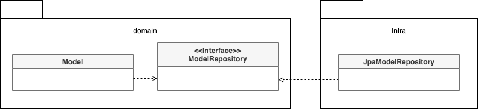
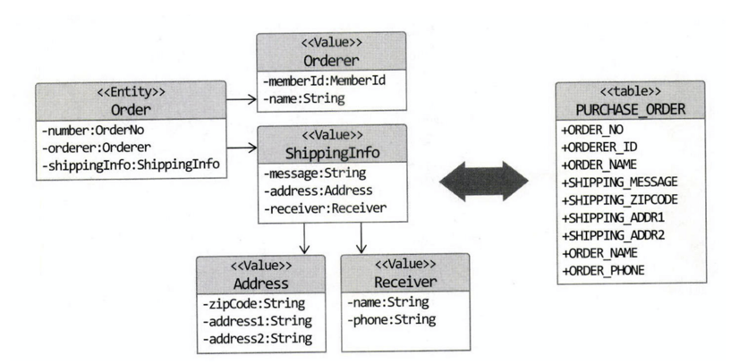
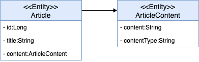

# 04. 리포지터리와 모델 구현

## 4.1 JPA 를 이용한 리포지터리 구현

도메인 모델과 리포지터리를 구현할 때 선호하는 기술은 JPA 를 들 수 있다.

데이터 보관소로 RDMS 를 사용할 때 객체 기반의 도메인 모델과 관계형  
데이터 모델 간의 매핑을 처리하는 기술로 ORM 만한 것이 없다.

### 4.1.1 모듈 위치

리포지터리 인터페이스는 애그리거트와 같이 도메인 영역에 속하고  
리포지터리를 구현한 클래스는 인프라스트럭처 영역에 속한다.

이는 리포지터리 구현 클래스를 인프라스트럭처 영역에 위치시켜서 인프라스트럭처에 대한 의존을 낮춰야 한다.



DIP 에 따라 리포지터리 구현 클래스는 인프라스트럭처 영역에 위치한다.

### 4.1.2 리포지터리 기본 기능 구현

리포지터리가 제공하는 기본 기능은 두가지다.

- ID로 애그리거트 찾기
- 애그리거트 저장하기

인터페이스는 애그리거트 루트 기준으로 작성한다.

ID 외에 다른 조건으로 애그리거트를 조회할때는 Criteria, JPQL 을 사용할수 있다.

삭제기능의 경우 실제 삭제 요구사항이 있더라도 삭제 데이터조회, 복구등을 위해  
일정 기간 보관해야 할수도 있어 삭제 플래그를 사용해서 화면에 보여줄지 여부를 결정하는 방식으로 구현하기도 한다.

## 4.2 스프링 데이터 JPA 를 이용한 리포지터리 구현

스프링과 JPA 를 적용할때 스프링 데이터 JPA 를 사용한다.  
지정한 규칙에 맞게 인터페이스를 정의하면 구현체를 만들어 스프링 Bean 으로 등록해준다.

> 스프링 데이터 JPA 인터페이스 규칙 및 메서드 설명이므로 생략

## 4.3 매핑 구현

### 4.3.1 엔티티와 밸류 기본 매핑 구현

애그리거트와 JPA 매핑을 위한 기본 규칙은 다음과 같다.

- 애그리거트 루트는 엔티티이므로 @Entity 로 매핑 설정한다.

한 테이블에 엔티티와 밸류 데이터가 같이 있다면

- 밸류는 @Embeddable 로 매핑 설정한다.
- 밸류 타입 프로퍼티는 @Embedded 로 매핑 설정한다.



엔티티와 밸류가 한테이블로 매핑

```java
@Entity
@Tagble(name = "purchase_order")
public class Order {
  // ...

  @Embedded
  private Orderer orderer;

  // ...
}

@Embeddable
public class Orderer {

  // MemberId에 정의된 칼럼 이름을 변경하기 위해
  // @AttributeOverride 애노테이션 사용
  @Embedded
  @AttributeOverrides(
      @AttributeOverride(name = "id", column = @Column(name = "orderer_id"))
  )
  private MemberId memberId;

  @Column(name = "orderer_name")
  private String name;

  // ...
}

@Embaddable
public class MemberId implements Serializable {

  @Column(name = "member_id")
  private String id;
  // ...
}
```

### 4.3.2 기본 생성자

밸류 타입의 경우 불변이므로 생성 시점에 필요한 값을 모두 전달받으므로 값을 변경하는 set 메서드는 제공하지 않는다.

하지만 JPA 의 @Entity 와 @Embeddable 로 클래스를 매핑하려면 기본 생성자를 제공해야 한다.

DB 에서 데이터를 읽어와 매핑된 객체를 생성할 때 기본 생성자를 사용해서 객체를 생성한다.  
이런 이유로 다른 코드에서 기본 생성자를 사용하지 못하도록 protected 로 선언한다.

```java
@Embeddable
public class Receiver {

  @Column(name = "receiver_name")
  private String name;

  // ...

  protected Receiver() {
  } // JPA를 적용하기 위해 기본 생성자 추가

  public Receiver(String name, String phone) {
    this.name = name;
    this.phone = phone;
  }

}
```

### 4.3.3 필드 접근 방식 사용

JPA 는 필드와 메서드의 두 가지 방식으로 매핑 처리를 할 수 있다.

메서드 방식을 사용하려면 get/set 메서드가 추가되어야한다.

set 메서드는 내부 데이터를 외부에서 변경할 수 있는 수단이 되기 때문에 캡슐화를 깨는 원인이 될 수 있다.     
엔티티가 객체로서 제 역활을 하려면 외부에 set 메서드 대신 의도가 잘 드러나는 기능을 제공해야 한다.

엔티티를 객체가 제공할 기능 중심으로 구현하도록 유도하려면 JPA 매핑 처리를 프로퍼티 방식이  
아닌 필드 방식으로 선택해서 불필요한 get/set 메서드를 구현하지 말아야 한다.

### 4.3.4 AttributeConverter 를 이용한 밸류 맵핑 처리

구현방식에 따라 밸류 타입의 프로퍼티를 한 개 칼럼에 매핑해야 할 때도 있다.

예를 들어 Length 가 길이 값과 단위의 두 프로퍼티를 갖고 있는데 DB 테이블에는  
한 개 칼럼에 '1000mm' 와 같은 형식으로 저장할 수 있다.

이때 사용할 수 있는 것이 AttributeConverter 이다.  
이는 밸류타입과 칼럼 데이터간의 변환을 처리하는 기능을 지원한다.

### 4.3.5 밸류 컬렉션: 별도 테이블 매핑

밸류 컬렉션을 별도 테이블로 매핑할 때는 @ElementCollection 과 @CollectionTable 을 함께 사용한다.

```java
@Entity
@Table(name = "purchase_order")
public class Order {

  // ...
  @ElementCollection
  @CollectionTable(name = "order_line", joinColumns = @JoinColumn(name = "order_number"))
  @OrderColumn(name = "line_idx")
  private list<OrderLine> orderLines;

}

@Embeddable
public class OrderLine {

  // ...
  @Embedded
  private ProductId productId;

}
```

### 4.3.6 밸류 컬렉션: 한 개 칼럼 매핑

밸류 컬렉션을 별도 테이블이 아닌 한 개 칼럼에 저장해야 할 때가 있다.

예를 들어, 도메인 모델에는 이메일 주소 목록을 Set 으로 보관하고 DB 에는 한 개 컬럼에 콤마로 구분해서 저장해야 할 때가 있다.

이때에도 AttributeConverter 를 사용하면 된다.  
단, AttributeConverter 를 사용하려면 밸류 컬렉션을 표현하는 새로운 밸류 타입을 추가해야 한다.

```java
public class EmailSet {

  private Set<Email> emails = new HashSet<>();

  private EmailSet() {
  }

  private EmailSet(Set<Email> emails) {
    this.emails.addAll(emails);
  }

  public Set<Email> getEmails() {
    return Collections.unmodifiableSet(emails);
  }

}
```

```java

@Converter
public class EmailSetConverter implements AttributeConveter<EmailSet, String> {

  @Override
  public String convertToDatabaseColumn(EmailSet attribute) {
    if (attribute == null) {
      return null;
    }
    return attribute.getEmails().stream()
        .map(Email::toString)
        .collect(Collectors.joining(","));
  }

  @Override
  public EmailSet convertToEntityAttribute(String dbData) {
    if (dbData == null) {
      return null;
    }
    String[] emails = dbData.split(",");
    Set<Email> emailSet = Arrays.stream(emails)
        .map(value -> new Email(value))
        .collect(toSet());
    return new EmailSet(emailSet);
  }

}
```

```java
@Column(name = "emails")
@Convert(converter = EmailSetConverter.class)
private EmailSet emailSet;
```

### 4.3.7 밸류를 이용한 ID 매핑

식별자라는 의미를 부각시키기 위해 식별자 자체를 밸류 타입을 만들 수도 있다.

밸류 타입을 식별자로 매피앟면 @Id 대신 @EmbeddedId 애너태이션을 사용한다.

```java
@Embeddable
public class OrderNo implements Serializable {

  @Column(name = "order_number")
  private String number;

  public boolean is2ndGeneration() {
    return number.startsWith("N");
  }
  
  // ...
}
```

밸류 타입으로 식별자를 구현 할 경우 식별자에 기능을 추가할수 있다.

JPA 에서 식별자 타입은 Serializable 타입이어야 한다.  
내부적으로 엔티티를 비교시 사용하는 equals() 와 hashcode() 메서드도 알맞게 구현해야한다.

### 4.3.8 별도 테이블에 저장하는 밸류 매핑

애그리거트에서 루트 엔티티를 뺀 나머지 구성요소는 대부분 밸류이다.   
만약 밸류가 아니라 엔티티가 확실하다면 다른 애그리거트는 아닌지 확인해야 한다.   
특히, 자신만의 독자적인 라이프사이클을 갖는다면 다른 애그리거트일 가능성이 높다.

밸류인지 엔티티인지 구분하는 방법은 고유 식별자를 갖는지 확인 하는것이다.

하지만 별도 테이블에 PK 가 있다고해서 테이블과 매핑되는 애그리거트가 항상  
고유 식별자를 갖는것은 아니다.

예를들어 Article 과 ArticleContent 가 나뉠 경우 ArticleContent 의 ID 는 식별자 이긴 하지만  
Article 데이터와 연결하기 위함이지 별도 식별자가 필요한 것은 아니기 때문이다.

이럴 경우 게시글의 특정 프로퍼티를 별도 테이블에 보관한 것으로 접근해야한다.



별도 테이블을 밸류로 매핑 한 모델

이때 밸류를 매핑한 테이블을 지정하기 위해 @SecondaryTable 과 @AttributeOverride 를 사용한다.

```java
@Entity
@Table(name = "article")
@SecondaryTable(
    name = "article_content",
    pkJoinColumns = @PrimaryKeyJoinColumn(name = "id")
)
public class Article {

  @Id
  private Long id;

  private String title;
  
  @AttributeOverrides({
      @AttributeOverride(name = "content", column = @Column(table = "article_content", name = "content")),
      @AttributeOverride(name = "contentType", column = @Column(table = "article_content", name = "content_type"))
  })
  private ArticleContent content;
  
}
```

@SecondaryTable 을 이용하면 아래 코드를 실행할 때 두 테이블을 조인해서 데이터를 조회한다.

한 가지 단점은 @SecondaryTable 을 사용하면 목록 화면에 보여줄 Article 을 조회할 때   
article_content 테이블까지 조인해서 데이터를 읽어오는데 이는 원하는 결과가 아니다. 

ArticleContent 를 엔티티로 매핑하고 지연로딩을 활용할수도 있지만 좋은 방법은 아니다.

이는 5장에서 조회 전용 쿼리를 실행하여 해결할 수 있다.

### 4.3.9 밸류 컬렉션을 @Entity 로 매핑하기

개념적으로 밸류인데 구현 기술의 한계나 팀 표준 때문에 @Entity 를 사용해야 할 때도 있다. 

JPA 는 @Embeddable 타입의 클래스 상속 매핑을 지원하지 않는다.   
대신 @Entity 를 이용한 상속 매핑으로 처리해야 한다. 

엔티티로 관리되므로 식별자 필드가 필요하고 타입 식별 칼럼을 추가해야 한다.

- @Inheritance 애너테이션 적용
- strategy SINGLE_TABLE 사용
- @DiscriminatorColumn 사용
- @DiscriminatorValue 사용

컬렉션에 clear() 를 사용할 경우 다수의 delete 쿼리가 발생하므로 성능상 좋지 않을 수 있다.

이방식을 사용하지 않고 @Embeddable 매핑 단일 클래스를 사용할 경우   
다형성을 포기하고 if-else 로 column 을 구분해야한다.

코드 유지보수와 성능의 두 가지 측면을 고려해서 구현 방식을 선택해야 한다.

### 4.3.10 ID 참조와 조인 테이블을 이용한 단방향 M-N 매핑

애그리거트 간 집합 연관은 성능상의 이유로 피해야 한다고 했다.

그럼에도 불구하고 요구사항을 구현하는 데 집합 연관을 사용하는 것이 유리하다면   
ID 참조를 이용한 단방향 집합 연관을 적용해 볼 수 있다.

```java
@Entity
@Table(name = "product")
public class Product {

  @EmbeddedId
  private ProductId id;

  @ElementCollection
  @CollectionTable(name = "product_category",
      joinColumns = @JoinColumn(name = "product_id"))
  private Set<CategoryId> categoryIds;

}
```

위 코드는 ID 참조를 이용한 애그리거트 간 단방향 M:N 연관은   
밸류 컬렉션 매핑과 동일한 방식으로 설정한 것을 알 수 있다. 

차이점이 있다면, 집합의 값에 밸류 대신 연관을 맺는 식별자가 온다.

@ElementCollection 을 이용하기 때문에 Product 를 삭제할 때  
매핑에 사용한 조인 테이블의 데이터도 함께 삭제된다.

## 4.4 애그리거트 로딩 전략

JPA 매핑을 설정할때 중요한점은 애그리겉의 속한 객체가 모두 모여야  
완전한 하나가 된다는 것이다.

애그리거트는 개념적으로 하나여야 한다.   
하지만, 루트 엔티티를 로딩하는 시점에 애그리거트에 속한 객체를 모두 로딩해야 하는 것은 아니다. 

애그리거트가 완전해야 하는 이유는 두가지 정도이다.

- 상태를 변경하는 기능을 실행할때 애그리거트 상태가 완전해야 한다.
- 표현 영역에서 애그리거트의 상태 정보를 보여줄 때 필요하다.

두번째의 경우 조회 전용 기능과 모델을 구현하는 방식을 사용하는것이 유리하다.

JPA 는 트랜잭션 범위 내에서 지연 로딩을 허용하기 때문에 다음 코드처럼   
실제로 상태를 변경하는 시점에 필요한 구성요소만 로딩해도 문제가 되지 않는다.

```java
@Transactional
public void revmoeoptions(ProductId id,int optIdxToBeDeleted){
  //Product를 로딩. 컬렉션은 지연 로딩으로 설정했다면 Option은 로딩되지 않음
  Product product = productRepository.findByid(id);

  // 트랜잭션 범위이므로 지연 로딩으로 설정한 연관 로딩 가능
  product.removeOption(optIdxToBeDeleted);
}    
```

```java
@Entity
public class Product {

  @ElementCollection(fetch = FetchType.LAZY)
  @CollectionTable(name = "product_option", joinColumns = @JoinColumn(name = "product_id"))
  @OrderColumn(name = "list_idx")
  private List<Option> options = new ArrayList<>();

  public void removeOption(int optIdx) {
    //실제 컬렉션에 접근할 때 로딩
    this.options.remove(optIdx);
  }

}
```

일반적으로 상태를 변경하기 보다는 조회하는 빈도 수가 높다.   
이런 이유로 애그리거트 내의 모든 연관을 즉시 로딩으로 설정할 필요는 없다. 

물론, 지연 로딩은 즉시 로딩보다 쿼리 실행 횟수가 많아질 가능성이 더 높다.   

따라서, 무조건 즉시 로딩이나 지연 로딩으로만 설정하기보다는  
애그리거트에 맞게 즉시 로딩과 지연 로딩을 선택해야 한다.

## 4.5 애그리거트의 영속성 전파

애그리거트는 완전한 상태여야 한다는 것은 조회할 때뿐만 아니라 저장하고 삭제할 때도 필요하다.

- 저장 메서드는 애그리거트 루트만 저장하면 안 되고 애그리거트에 속한 모든 객체를 저장해야 한다
- 삭제 메서드는 애그리거트 루트뿐만 아니라 애그리거트에 속한 모든 객체를 삭제 해야 한다.

@Embeddable 매핑 타입의 경우 함께 저장되고 삭제되므로 cascade 속성을  
추가로 설정하지 않아도 된다. 

반면에 애그리거트에 속한 @Entity 타입에 대한 매핑은 cascade 속성을  
사용해서 저장과 삭제 시에 함께 처리되도록 설정해야 한다.

@OneToOne, @OneToMany 는 cascade 속성의 기본값이 없으므로 cascade 속성값으로  
CascadeType.PERSIST, CascadeType.REMOVE 를 설정한다.

## 4.6 식별자 생성 기능

식별자는 크게 세가지 방식으로 생성한다.

- 사용자가 직접 생성
- 도메인 로직으로 생성
- DB 를 이용한 일련번호 사용

식별자 생성 규칙이 있다면 별도 서비스로 식별자 생성 긴으을 분리해야한다.  
이는 도메인 규칙이므로 도메인 영역에 위치시켜야 한다.  
예를 들어 도메인 서비스를 만드는 방법이 있다.

식별자 생성 규칙을 구현하기에 적합한 또 다른 장소는 리포지터리다.  
인터페이스에 기능을 추가하고 구현 클래스에서 알맞게 구현하면 된다.

DB 자동증가 컬럼을 식별자로 사용할 경우 @GeneratedValue 를 사용하며  
DB 에 insert 쿼리가 실행돼야 식별자가 생성된다.

JPA 의 식별자 생성 기능을 사용하는 경우에도 저장시점에 식별자를 생성한다.

## 4.7 도메인 구현과 DIP

JPA 를 사용할 경우 도메인에 @Entity, @Table 등 구현 기술에 특화된
애너테이션을 사용하고 있다.

DIP 에 따르면 이는 구현 기술에 속하므로 도메인 모델이 구현 기술인  
JPA 에 의존하면 안된다.

Repository 의 경우 스프링 데이터 JPA 의 Repository 인터페이스를  
상속하고 있으므로 이는 도메인이 인프라에 의존하는 것이다.

도메인에서 구현 기술에 대한 의존을 없애려면 구현 클래스를   
인프라에 위치시켜야한다.

DIP 를 적용하는 이유는 저수준 구현이 변경되어도 고수준이 영향 받지 않도록  
하기 위함인데 리포지터리와 도메인 모델의 구현 기술은 거의 바뀌지 않는다.

따라서 이런 거의 변경이 없는 경우에도 변경을 미리 대비하는것은 오버엔지니어링일 수 있다.

저자의 경우 애그리거트, 리포지터리 등 도메인 모델을 구현할때  
JPA 전용 애너테이션을 사용하는것으로 타협했다.

DIP 를 완전히 지키면 좋겠지만 개발 편의성과 실용성을 가져가면서  
구조적인 유연함을 유지했으며 복잡도를 높이지 않으면서 구현 기술에  
따른 제약이 낮다면 합리적인 선택이라고 생각한다.
