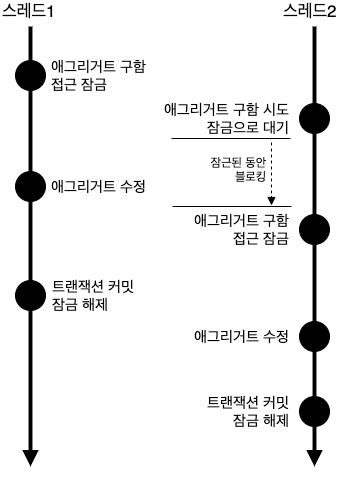
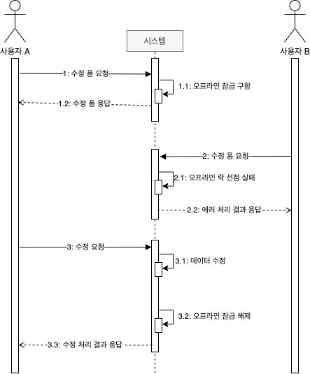

# 08. 애그리거트 트랜잭션 관리

## 8.1 애그리거트와 트랜잭션

여러 스레드에서 각각 트랜잭션을 커밋할 때 수정한 내용을 DBMS 에 반영한다.  
이때 애그리거트의 일관성이 깨질수 있다.

일관성이 깨지지도 않도록 하는 방법은 트랜잭션 처리와 관련이 있다.  
애그리거트에 대해 사용할 수 있는 대표적인 트랜잭션 처리 방식에는 선점(Pessimistic) 잠금과  
비선점(Optimistic) 잠금의 두 가지 방식이 있다.

Pessimistic Lock(비관적 잠금), Optimistic(낙관적 잠금) 이라는 용어를 쓰기도한다.

## 8.2 선점 잠금

선점 잠금은 먼저 애그리거트를 구한 스레드가 애그리거트 사용이 끝날 때까지  
다른 스레드가 해당 애그리거트를 수정하는 것을 막는 방식이다.



한 스레드가 애그리거트를 구하고 수정하는 동안 다른 스레드가 수정할 수 없으므로  
동시에 애그리거트를 수정할 때 발생하는 데이터 충돌 문제를 해소할 수 있다.

선점 잠금은 보통 DBMS 가 제공하는 행 단위 잠금을 사용해서 구현한다.

오라클을 비롯한 다수 DBMS 가 for update 와 같은 쿼리를 사용해서   
특정 레코드에 한 사용자만 접근할 수 있는 잠금 장치를 제공한다.

JPA 의 EntityManager 를 사용할 경우 LockModeType.PESSIMISTIC_WRITE 사용  
스프링 데이터 JPA 사용시 @Lock(LockModeType.PESSIMISTIC_WRITE) 사용

### 8.2.1 선전 잠금과 교착 상태

선점 잠금 기능을 사용할 떄는 잠금 순서에 따른 교착 상태(dealock)가 발생하지 않도록 주의해야 한다.

선점 잠금에 따른 교착상태는 사용자가 많을때 발생할 가능성이 높고  
사용자수가 많으면 교착상태에 빠지는 스레드는 더 증가한다.

이런 문제가 발생하지 않도록 하려면 잠금을 구할 때 최대 대시 시간을 지정해야 한다.   
JPA 에서 선점 잠금을 시도할 때 최대 대기 시간을 지정하려면 다음과 같이 힌트를 사용하면 된다.

```java
Map<String, Object> hints = new HashMap<>();
hints.put("javax.persistence.lock.timeout", 2000);
Order order = entityManager.find(Order.class, orderNo, LockModeType.PESSIMISTIC_WRITE, hints);
```

스프링 데이터 JPA 사용시 @QueryHints, @QueryHint 사용

DBMS 에 따라 교착 상태에 따라 커넥션을 처리하는 방식이 다르다.

따라서 선점 잠금을 사용하려면 사용하는 DBMS 에 대해 JPA 가   
어떤 식으로 대기 시간을 처리하는지 반드시 확인해야 한다.

## 8.3 비선점 잠금

선점 잠금이 강력해 보이긴 하지만 선점 잠금으로 모든 트랜잭션 충돌 문제가 해결되는 것은 아니다.

비선점 잠금은 변경한 데이터를 실제 DBMS 에 반영하는 시점에 변경 가능 여부를 확인하는 방식이다.

비선점 잠금을 구현하려면 애그리거트에 버전으로 사용할 숫자 타입의 프로퍼티를 추가해야 한다.   
애그리거트를 수정할 때마다 버전으로 사용할 프로퍼티의 값이 1씩 증가한다.

다른 트랜잭션이 먼저 데이터를 수정해서 버전 값이 바뀌면 데이터 수정에 실패하게 된다.

JPA 는 엔티티가 변경되어 UPDATE 쿼리를 실행할 때   
@Version 에 명시한 필드를 이용해서 비선점 잠금 쿼리를 실행한다.

```java
@Entity
@Table(name = "purchage_order")
public class Order {

  @EmbeddedId
  private OrderNo number;

  @Version
  private long version;
  
  // ...
}
```

비선점 잠금을 위한 쿼리를 실행할 때 쿼리 실행 결과로 수정된 행의 개수가 0이면  
이미 누군가 앞서 데이터를 수정한 것이다. 

이는 트랜잭션이 충돌한 것이므로 트랜잭션 종료 시점에 익셉션이 발생한다.   
(OptimisticLockingFailureException)

비선점 잠금 방식을 여러 트랜잭션으로 확장하려면 애그리거트 정보를  
뷰로 보여줄 때 버전 정보도 함께 사용자 화면에 전달해야 한다.

응용 서비스는 전달받은 버전값을 이용해서 애그리거트의 버전값과 비교후  
일치하는 경우에만 기능을 수행하면 된다.

### 8.3.1 강제 버전 증가

애그리거트에 애그리거트 루트 이외 다른 에티티가 수정 될 경우  
JPA 는 루트 엔티티 자체는 변경되지 않았으므로 버전 값을 갱신하지 않는다.

애그리거트 내에 어떤 구성요소의 상태가 바뀌면 루트 애그리거트의  
버전 값을 증가해야 비선점 잠금이 올바르게 동작한다.

JPA 는 이런 문제를 처리할 수 있도로 엔티티를 구할때 강제로 버전 값을 증가시키는 잠금 모드를 지원하고 있다.

```java
@Repository
public class JpaOrderRepository implements OrderRepository {

  @PersistenceContext
  private EntityMangager entityManager;

  @Override
  public Order findByIdOptimisticLockMode(OrderNo id) {
    return entityManager.find(Order.class, id, LockModeType.OPTIMISTTIC_FORCE_INCREMENT);
  }

}
```

스프링 데이터 JPA 를 사용하면 앞에서 살펴본 @Lock 을 사용하면 된다.

## 8.4 오프라인 선점 잠금

더 엄격하게 데이터 충돌을 막고 싶다면 누군가 수정화면을 보고 있을  
경우 수정 화면 자체를 실행하지 못하도록 해야 한다. 

한 트랜잭션 범위에서만 적용되는 선점 잠금 방식이나 나중에 버전 충돌을 확인하는  
비선점 잠금 방식으로는 이를 구현할 수 없다. 

이때 필요한 것이 오프라인 선점 잠금 방식이다.



사용자 A 가 3의 수정 요청을 수행하지 않고 프로그램을 종료하면  
다른 사용자는 영원히 잠금을 구할 수 없는 상황이 발생한다.

따라서 오프라인 선점 잠금 방식은 유효시간을 가져야하며  
접근해 있는 사용자는 일정 주기로 유효시간 연장 api 를 호출하면 된다.

### 8.4.1 오프라인 선점 잠금을 위한 LockManager 인터페스와 관련 클래스

오프라인 선점 잠근은 크게 4가지 기능이 필요하다.

- 잠금 선점 시도
- 잠금 확인
- 잠금 해제
- 잠금 유효시간 연장

추가) 실제 구현 내용은 책에서 확인

### 8.4.2 DB를 이용한 LockManager 구현

DB 를 사용할 경우 잠금 정보 저장 테이블을 사용한다.

추가) 실제 구현 내용은 책에서 확인

