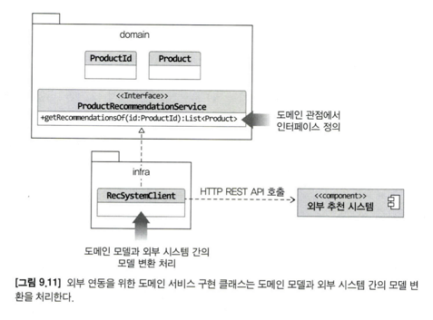
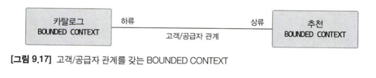

# 09. 도메인 모델과 바운디드 컨텍스트

## 9.1 도메인 모델과 경계

하위 도메인 마다 같은 용어라도 의미가 다르고 같은 대상이라도 지칭하는 용어가 다를수 있다.

하위 도메인 마다 사용하는 용어가 다르므로 올바른 도메인 모델 개발을 위해선  
하위 도메인 마다 모델을 만들어야 한다.

모델은 특정한 컨텍스트(문맥) 하에서 완전한 의미를 갖는다.  
같은 제품이라도 컨텍스트에 따라 의미가 다르다. 

이렇게 구분되는 경계를 갖는 컨텍스트를 DDD 에선 바운디드 컨텍스트라고 부른다.

## 9.2 바운디드 컨텍스트

바운디드 컨텍스트는 모델의 경계를 결정하며, 한 개의 바운디드 컨텍스트는 논리적으로 한 개의 모델을 갖는다.  
바운디드 컨텍스트는 용어를 기준으로 구분한다.

바운디드 컨텍스트는 실제로 사용자에게 기능을 제공하는 물리적 시스템으로   
도메인 모델은 이 바운디드 컨텍스트 안에서 도메인을 구현한다.

이상적으로 하위 도메인과 바운디드 컨텍스트가 일대일 관계를 가지면 좋겠지만  
그렇지 않을 때가 많으며 기업의 팀 조직 구조에 따라 결정되기도 한다.


규모가 작은 기업은 전체 시스템을 한 개 팀에서 구현할 때도 있다.

여러 하위 도메인을 하나의 바운디드 컨텍스트에서 개발할 때 주의할 점은  
하위 도메인의 모델이 섞이지 않도록 하는것이다.  
아무래도 전체 하위 도메인을 위한 단일 모델을 만들고 싶은 유혹에 빠지기 쉽다.

비록 한 개의 바운디드 컨텍스트가 여러 하위 도메인을 포함하더라도 하위 도메인마다  
구분되는 패키지를 갖도록 구현하여 하위 도메인을 위한 모델이 뒤섞이지 않도록 하는 효과를 낼 수있다.


바운디드 컨텍스트는 도메인 모델을 구분하는 경계가 되기 때문에  
구현 하는 하위 도메인에 알맞는 모델을 포함한다.


## 9.3 바운디드 컨텍스트 구현

바운디드 컨텍스트는 도메인 모델만 포함하는 것은 아니다.  
도메인 기능을 사용자에게 제공하기 위해 표현 영역, 응용 서비스, 인프라 영역 등을 모두 포함한다.

도메인 모델의 구조가 바뀌면 DB 테이블 스키마도 함께 변경해야 하므로  
해당 테이블도 바운디드 컨텍스트에 포함된다.


모든 바운디드 컨텍스트를 반드시 도메인 주도로 개발할 필요는 없다.  
복잡한 도메인 로직이 없을 경우 서비스-DAO 구조를 사용할수도 있다.


한 바운디드 컨텍스트에서 두 방식을 혼합해서 사용할 수도 있다.  
대표적인 예가 CQRS 패턴이다.

CQRS(Command Query Responsibility Segregation)는 상태를 변경하는 명령 기능과   
내용을 조회하는 쿼리 기능을 위한 모델을 구분하는 패턴이다.


각 바운디드 컨텍스트는 서로 다른 구현 기술을 사용할 수도 있다.  
바운디드 컨텍스트가 반드시 사용자에게 보여지는 UI를 갖지 않고 JSON 으로 응답할 수도 있다.

## 9.4 바운디드 컨텍스트 간 통합

쇼핑 사이트에서 매출 증대를 위해 카탈로그 하위 도메인에 개인화 추천 기능을 도입했다고 하자.   
추천 시스템을 담당하는 팀이 새로 생겨서 해당 팀에서 주도적으로 추천 시스템을 만들기로 했다.

이렇게 되면 카탈로그 하위 도메인에 추천 기능을 위한 바운디드 컨텍스트가 생긴다.


두 팀이 관련된 바운디드 컨텍스트를 개발하면 자연스럽게 두 바운디드 컨텍스트 간 통합이 발생한다.

이때 중요한 점은 카탈로그 컨텍스트와 추천 컨텍스트의 도메인 모델이 서로 다르다는 점이다.   
카탈로그는 제품을 중심으로 도메인 모델을 구현하지만 추천은 추천 연산을 위한 모델을 구현한다.

카탈로그 시스템은 추천 시스템에서 받은 상품 모델을 사용하기보다는 카탈로그 도메인 모델을  
사용해서 추천 상품을 표현해야 한다. 

즉 다음과 같이 카탈로그의 모델을 기반으로 하는 도메인 서비스를 사용해서 추천 기능을 표현해야 한다.

```java
// 상품 추천 기능을 표현하는 도메인 서비스
public interface ProductRecommendationService {
  List<Product> getRecommendationOf(ProductId id);
}
```

도메인 서비스를 구현한 클래스는 인프라스트럭처 영역에 위치한다.   
이 클래스는 외부 시스템과의 연동을 처리하고 외부 시스템의 모델과 현재 도메인 모델 간의 변환을 책임진다.



RecSystemClient 는 외부 추천 시스템이 제공하는 REST API 를 이용해서  
특정 상품을 위한 추천 상품 목록을 로딩한다. 

해당 응답은 카탈로그 도메인 모델과 일치하지 않을 수 있다.

```text
[
    {itemID: 'PROD-1000', type: 'PRODUCT', rank: 100},
    {itemID: 'PROD-1001', type: 'PRODUCT', rank: 54}
]
```

RecSystemClient 가 REST API 를 통해 데이터를 읽어오고 카탈로그에 맞는 도메인으로 변환한다.  
아래는 해당 코드를 나타낸 것이다.

```java
public class RecSystemClient implements ProductRecommendationService {

  private ProductRepository productRepository;

  @Override
  public List<Product> getRecommendationOf(ProductId id) {
    List<Recommendation> items = getRecItems(id.getValue());
    return toProducts(items);
  }

  private List<RecommendationItem> getRecItems(String itemId) {
    return externalRecClient.getRecs(itemId);
  }

  private List<Product> toProducts(List<RecommendationItem> items) {
    return items.stream()
        .map(item -> toProductId(item.getItemId()))
        .map(prodId -> productRepository.findById(prodId))
        .collect(toList());
  }

  private ProductId toProductId(String itemId) {
    return new ProductId(itemId);
  }

}
```

두 모델 간의 변환 과정이 복잡하면 변환 처리를 위한 별도 클래스를  
만들고 이 클래스에서 변환을 처리해도 된다.


REST API 호출은 두 바운디드 컨텍스트를 직접 통합하는 방법이다.  

간접적으로 통합하는 대표적인 방식은 메세지 큐를 사용하는것이다.

이 경우 두 바운디드 컨텍스트가 메세지의 데이터 구조를 맞춰야 한다.  
또한 어떤 관점에서 모델을 사용하느냐에 따라 구현 코드가 달라지게 된다.

메세징 큐에 담을 구조를 협의할때 그 큐를 누가 제공하느냐에 따라 데이터 구조가 결정된다.  
즉, 한쪽에서 메세지를 출판하고 다른 쪽에서 구독하는 출판/구독 모델을 따른다.

### 마이크로서비스와 바운디드 컨텍스트

MSA 는 단순 유행을 지나 많은 기업에서 자리를 잡아가고 있다.   
넷플릭스나 아마존 뿐 아니라 국내에도 많은 기업이 MSA 를 수용하고 있다.   
MSA 는 REST API 나 메시징 큐를 이용해서 통신하는 구조를 가진다.

이런 마이크로 서비스의 특징은 DDD 의 바운디드 컨텍스트와 잘 어울린다. 

각 바운디드 컨텍스트는 모델의 경계를 형성하는데 바운디드 컨텍스트를 마이크로 서비스로  
구현하면 자연스럽게 컨텍스트별로 모델이 분리된다.

마이크로서비스마다 프로젝트를 생성하므로 바운디드 컨텍스트마다 프로젝트를 만들게 된다.  
이것은 코드 수준에서 모델을 분리하여 두 바운디드 컨텍스트가 섞이지 않도록 해준다.

별도 프로세스로 개발한 바운디드 컨텍스트는 독립적으로 배포하고 모니터링하며 확장되는데  
이 역시 마이크로서비스가 갖는 특징이다.

## 9.5 바운디드 컨텍스트 간 관계

두 바운디드 컨텍스트간 관계 중 가장 흔한 관계는 한쪽에서 API 를 제공하고  
다른 한쪽에서는 그 API 를 호출하는 관계이다.

이 관계에서 API 를 사용하는 바운디드 컨텍스트는 API 를 제공하는    
바운디드 컨텍스트에 의존하게 된다.



### 공개 호스트 서비스(OPEN HOST SERVICE)

상류 팀의 고객인 하루 팀이 다수 존재하면 상류 팀은 여러 하류팀의  
요구사항을 수용할 수 있는 API 를 만들고 이를 서비스 형태로 공개하여  
일관성을 유지할수 있다.

공개 호스트 서비스의 대표적인 예는 검색이다.  
이때 상류 컴포넌트는 검색 시스템이고, 하류 컴포넌트는 블로그, 카페, 게시판등이 된다.


상류 컴포넌트의 서비스는 상류 바운디드 컨텍스트의 도메인 모델을 따른다.  
따라서 하류 컴포넌트는 자신의 모델에 영향을 주지 않도록 보호해 주는 완충 지대를 구축해야 한다.  
이 완충 지대를 **안티코럽션 계층(Anticorruption Layer)** 이라고 부른다.

앞선 코드에서 `RecSystemClient` 가 안티코럽션 계층이다.

### 공유 커널(SHARED KERNEL)

두 바운디드 컨텍스트가 같은 모델을 공유하는 경우도 있다.  
같은 서비스를 구축하는 두 팀에서 해당 서비스 모델을 공유함으로써 공통된 개발을 막을 수 있다.  

이렇게 두 팀이 공유하는 모델을 공유 커널(SHARED KERNEL)이라고 부른다.  
공통된 개발을 줄일수 있다는 장점이 있지만, 임의로 모델을 변경해서는 안되며 두 팀이 밀접한 관계를 유지해야한다.  

두 팀이 밀접한 관계를 형성할 수 없다면 공유 커널을 사용할 때의 장점보다  
공유 커널로 인해 개발이 지연되고 정체되는 문제가 더 커지게 된다.

### 독립 방식 관계(SEPARATE WAY)

독립 방식 관계는 서로 통합하지 않는 방식이다.  
두 바운디드 컨텍스트간에 통합을 하지 않으므로 서로 독립적으로 모델을 발전시킨다.  


독립 방식에서 두 바운디드 컨텍스트간에 통합은 사용자가 직접 수동으로 이루어진다.  
수동으로 통합하는 방식이 나쁜 것은 아니지만 규모가 커질수록 한계가 있으므로  
두 바운디드 컨텍스트를 통합해야한다.


## 9.6 컨텍스트 맵

개별 바운디드 컨텍스트에 매몰되면 전체를 보지 못할 때가 있다.  
전체 비지니스를 조망할 수 있는 지도가 필요한데 그것이 바로 컨텍스트 맵이다.  

컨텍스트 맵은 바운디드 컨텍스트 간의 관계를 표시한 것이다.


상단의 그림은 오픈 호스트 서비스(OHS) 와 안티코럽션 계층(ACL)이 표시되어있다.

바운디드 컨텍스트 영역에 주요 애그리거트를 함께 표시하면 모델에 대한  
관계가 더 명확히 드러난다.

추가로 하위 도메인이나 조직 구조를 함께 표시하면 도메인을 포함한  
전체 관계를 이해 하는데 도움이 된다. 

컨텍스트 맵은 시스템의 전체 구조를 보여준다.

이는 하위 도메인과 일치하지 않는 바운디드 컨텍스트를 찾아 도메인에 맞게   
바운디드 컨텍스트를 조절하고 사업의 핵심 도메인을 위해 조직 역량을  
어떤 바운디드 컨텍스트에 집중할지 파악하는데 도움을 준다.

컨텍스트 맵을 그리는 규칙은 따로 없다. 간단한 도형과 선을 이용해서  
각 컨텍스트의 관계를 이해할 수 있는 수준에서 그리면 된다.

컨텍스트 맵은 전체 시스템의 이해 수준을 보여준다.  
즉, 시스템을 더 잘 이해하거나 시간이 지나면서 컨텍스트간 관계가 바뀌면  
컨텍스트 맵도 함께 바뀐다.
