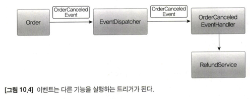
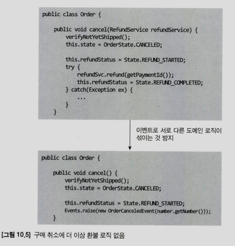
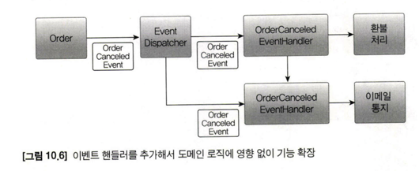
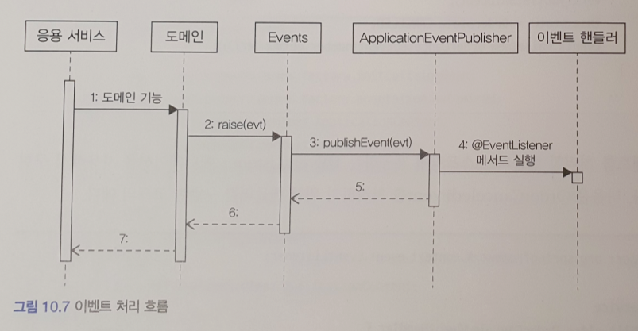
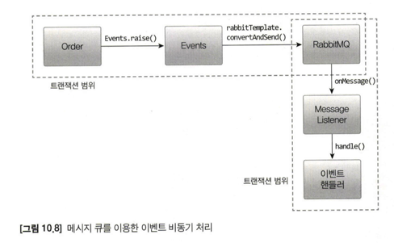
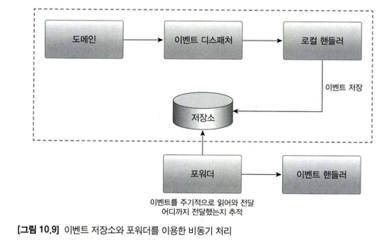
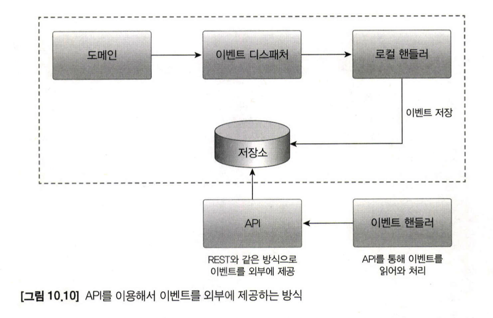
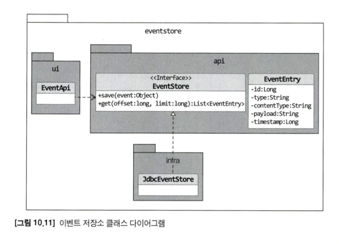

# 10. 이벤트

## 10.1 시스템 간 강결합 문제

주문 도메인에서 환불을 진행하려고 할때 환불 기능을 제공하는     
도메인 서비스를 통해 실행하게 된다.

보통 결제 시스템은 외부에 존재하므로 도메인 서비스에서 외부서비스를 호출한다.

이때 여러 문제가 발생할수 있다.

첫번째로 외부 서비스가 정상이 아닐 경우 트랜잭션 처리를 어떻게 해야하는가?  
환불기능 실행중 예외 발생시 롤백할지 커밋할지 애매하다. 

두번째로 외부 시스템의 응답이 길어질 경우의 성능 문제이다.  
환불 처리 기능이 오래걸릴수록 주문 취소 기능 또한 대기 시간이 증가한다.    
즉, 외부 서비스 성능에 직접적인 영향을 받는다.

추가적인 문제로 설계상 문제가 나타날 수 있다.  
주문을 표현하는 도메인에 결제 도메인의 환불 로직이 뒤섞이게 된다.

지금 까지 언급한 문제가 발생하는 이유는 주문과 결제 바운디드 컨텍스트의  
강결합 때문이다.

이런 강결합은 이벤트를 통해 없앨수 있다.  
특히 비동기 이벤트를 사용하면 두 시스템 간의 결합을 크게 낮출 수 있다.

## 10.2 이벤트 개요

이 절에서 사용하는 이벤트라는 용어는 '과거에 벌어진 어떤 것' 을 뜻한다.   
이벤트가 발생한다는 것은 상태가 변경됐다는 것을 의미한다.

### 10.2.1 이벤트 관련 구성요소

도메인 모델에 이벤트를 도입하려면 아래와 같은 네 개의 구성요소를 구현해야한다.

- 이벤트
- 이벤트 생성 주체
- 이벤트 디스패처(퍼블리셔)
- 이벤트 핸들러(구독자)


도메인 모델에서 이벤트 생성주체는 엔티티, 밸류, 도메인 서비스와 같은 도메인 객체이다.

이벤트 핸들러는 이벤트 생성 주체가 발생한 이벤트에 반응한다.

이벤트 생성 주체와 이벤트 핸들러를 연결해 주는것이 이벤트 디스패처다.  
이벤트 디스패처의 구현 방식에 따라 이벤트 생성과 처리를 동기나 비동기로 실행하게 된다.

### 10.2.2 이벤트의 구성

이벤트는 발생한 이벤트에 대한 정보를 담는다.

- 이벤트 종류: 클래스 이름을 이벤트 종류를 표현
- 이벤트 발생 시간
- 추가 데이터: 주문번호, 신규 배송지 정보 등 이벤트와 관련된 정보

### 10.2.3 이벤트 용도

이벤트는 크게 2가지 용도로 쓰인다.

- 트리거
  - 도메인의 상태가 바뀔때 후처리가 필요할 경우 후처리를 실행하기 위한 트리거로 이벤트를 사용할 수 있다.
- 타 시스템간의 데이터 동기화
  - 이벤트를 사용하면 서로 다른 도메인 로직이 섞이는 것을 방지할 수 있다.



### 10.2.4 이벤트 장점

이벤트를 사용하면 서로 다른 도메인 로직이 섞이는 것을 방지할 수 있다.



이벤트 핸들러를 사용하면 기능 확장도 용이하다.  
기능을 확장해도 구매 취소 로직은 수정할 필요가 없다.



## 10.3 이벤트, 핸들러, 디스패처 구현

- 이벤트 클래스: 이벤트를 표현한다.
- 디스패처: 스프링이 제공하는 ApplicationEventPublisher 를 이용한다.
- Events: 이벤트를 발생한다.
- 이벤트 핸들러: 이벤트를 수신해서 처리한다.

### 10.3.1 이벤트 클래스

이벤트 자체를 위한 상위 타입은 존재하지 않는다.   
원하는 클래스를 이벤트로 사용하면 된다.  

이벤트 클래스의 이름을 결정할때는 과거 시제를 사용해야 한다.

이벤트클래스는 이벤트를 처리하는데 필요한 최소한의 데이터를 포함해야 한다.

```java
public class OrderCanceledEvent {
  // 이벤트는 핸들러에서 이벤트를 처리하는 데 필요한 데이터를 포함한다.
  private String orderNumber;

  public OrderCanceledEvent(String number) {
    this.orderNumber = number;
  }

  public String getOrderNumber() {
    return orderNumber;
  }

}
```

모든 이벤트가 공통으로 갖는 프로퍼티가 존재할 경우

```java
public abstract class Event {

  private long timestamp;

  public Event() {
    this.timestamp = System.currentTimeMillis();
  }

  public long getTimestamp() {
    return timestamp;
  }

}

// 발생 시간이 필요한 각 이벤트 클래스는 Event 를 상속받아 구현한다.
public class OrderCanceledEvent extends Event {

  private String orderNumber;

  public OrderCanceledEvent(String number) {
    super();
    this.orderNumber = number;
  }

}
```

### 10.3.2 Events 클래스와 ApplicationEventPublisher

```java
public class Events {

  private static ApplicationEventPublisher publisher;

  static void setPublisher(ApplicationEventPublisher publisher) {
    Events.publisher = publisher;
  }

  public static void raise(Object event) {
    if (publisher != null) {
      publisher.publishEvent(event);
    }
  }

}
```

```java
@Configuration
public class EventsConfig {

  @Bean
  public InitializingBean eventsInitializer(ApplicationEventPublisher eventPublisher) {
    return () -> Events.setPublisher(eventPublisher);
  }

}
```

### 10.3.3 이벤트 발생과 이벤트 핸들러

```java
public class Order {

  public void cancel() {
    verifyNotYetShipped();
    this.state = OrderState.CANCELED;
    Events.raise(new OrderCanceledEvent(number.getNumber()));
  }

}
```

```java
public class OrderCanceledEventHandler {

  private RefundService refundService;

  public OrderCancelOrderService(RefundService refundService) {
    this.refundService = refundService;
  }

  @EventListener(OrderCanceledEvent.class)
  public void handle(OrderCanceledEvent orderCanceledEvent) {
    refundService.refund(event.getOrderNumber());
  }

}
```

### 10.3.4 흐름 정리



코드 흐름을 보면 응용 서비스와 동일한 트랜잭션 범위에서 이벤트 핸들러를 실행하고 있다.  
즉, 도메인 상태 변경과 이벤트 핸들러는 같은 트랜잭션 범위에서 실행된다.

## 10.4 동기 이벤트 처리 문제

이벤트를 사용해서 강결합 문제는 해소 했지만 외부 서비스에 영향을 받는 문제는 남아있다.

- 응용 서비스 코드에서 외부 연동 과정에서 예외 발생시 트랜잭션 처리는?
- 이벤트 핸들러에서 외부 서비스 호출시 느려지거나 예외가 발생한다면?

외부 시스템 연동을 동기로 처리할때 성능과 트랜잭션 범위 문제를 해소 하는 방법은  
이벤트를 비동기로 처리하거나 이벤트와 트랜잭션을 연계 하는것이다.

## 10.5 비동기 이벤트 처리

이벤트를 비동기로 구현할 수 있는 방법

- 로컬 핸들러를 비동기로 실행하기
- 메세지 큐를 사용하기
- 이벤트 저장소와 이벤트 포워더 사용하기
- 이벤트 저장소와 이벤트 제공 API 사용하기

### 10.5.1 로컬 핸들러 비동기 실행

스프링이 제공하는 `@Async` 어노테이션을 사용하면 된다.

- `@EnableAsync` 어노테이션을 사용하여 비동기 기능 활성화
- 이벤트 핸들러 메서드에 `@Async` 어노테이션을 추가

```java
public class OrderCanceledEventHandler {

  // ...
  
  @Async
  @EventListener(OrderCanceledEvent.class)
  public void handler(OrderCanceledEvent orderCanceledEvent) {
    refundService.refund(event.getOrderNumber());
  }

}
```

### 10.5.2 메시징 시스템을 이용한 비동기 구현

카프카(Kafka), 래빗MQ(RabbitMQ) 와 같은 메세징 시스템 사용.

이벤트 발생시 디스패처는 이벤트를 메세지 큐에 보낸다.  
메세지 큐는 이벤트를 메세지 리스너에 전달하고  
메세지 리스너는 알맞는 이벤트 핸들러를 이용해서 이벤트를 처리한다.



필요 하다면 이벤트 발생 도메인 기능과 메세지 큐 이벤트 저장 절차를  
한 트랜잭션으로 묶어야 한다.

이러한 글로벌 트랜잭션은 안전하게 이벤트를 메세지 큐에 전달할수 있는  
장점이 있지만 반대로 글로벌 트랜잭션으로 인해 전체 성능을 떨어지는 단점도 있다.

래빗MQ는 글로벌 트랜잭션 지원을 지원하며 카프카는 글로벌 트랜잭션을 지원하진 않지만  
다른 메세징 시스템에 비해 높은 성능을 보여준다.

### 10.5.3 이벤트 저장소를 이용한 비동기 처리

이벤트를 일단 DB 에 저장한 뒤에 별도 프로그램을 이용해서  
이벤트 핸들러에 전달하는 방법도 있다.





#### 이벤트 저장소 구현

이벤트 저장소를 구현한 코드 구조는 하단과 같다.



추가) 실제 구현 내용은 책에서 확인

## 10.6 이벤트 적용 시 추가 고려 사항

1. 이벤트 소스를 EventEntry 에 추가할지 여부
   - 위에서 구현한 EventEntry 는 이벤트 발생 주체가 없다.
   - 따라서 특정 주체가 발생한 이벤트만 조회하는 기능을 구현할 수 없다.
   - 필요할 경우 이벤트에 발생 주체 정보를 추가 해야한다.
2. 포워더에서 전송 실패를 얼마나 허용할 것이냐에 대한 여부
   - 특정이벤트에서 계속 전송을 실패하게되면 이 이벤트 때문에 나머지 이벤트를 전송할수 없게된다.
   - 이럴때 실패한 이벤트의 재전송 횟수에 제한을 두어야 한다.
   - 실패 이벤트를 생략하지 않고 실패용 DB 나 메세지 큐에 저장하기도 한다.
3. 이벤트 손실에 대한 여부
   - 이벤트 저장소를 사용하는 방식은 이벤트 발생과 이벤트 저장을 한 트랜잭션으로   
     처리하기 떄문에 트랜잭션에 성공하면 이벤트가 저장소에 보관된다는 것을 보장할 수 있다.
   - 반면 로컬 핸들러를 이용해서 이벤트를 비동기로 처리할 경우 이벤트 처리에 실패하면 이벤트를 유실하게 된다.
4. 이벤트 순서에 대한 여부
   - 이벤트를 발생 순서대로 외부 시스템에 전달해야 할 경우 이벤트 저장소를 사용하는것이 좋다.
   - 이벤트 저장소는 일단 저장소에 이벤트를 발생순서대로 저장하고 그 순서대로 이벤트 목록을 제공하기 떄문이다.
   - 반면 메시징 시스템은 사용 기술에 따라 이벤트 발생 순서와 메시지 전달 순서가 다를수 있다.
5. 이벤트 재처리에 대한 여부
   - 동일한 이벤트를 다시 처리해야 할때 이벤트를 어떻게 할지 결정해야 한다.
   - 가장 쉬운 방법은 마지막으로 처리한 이벤트 순번을 기억해 두었다가 이미 처리한 순번의  
     이벤트가 도착하면 해당 이벤트를 처리하지않고 무시하는것이다.
   - 이외에 이벤트 처리를 멱등으로 처리하는 방법도 있다.

### 멱등성

연산을 여러 번 적용해도 결과가 달라지지 않는 성질을 멱등성 이라고한다.  

대표적인 함수가 `abs()` 이다.  
`abs(x)`, `abs(abs(x))` `abs(abs(abs(x)))` 의 결과가 모두 같다.

이벤트 핸들러가 멱등성을 가지면 시스템 장애로 인한 이벤트 중복이 발생하더라도  
결과적으로 동일 상태가 된다.

이는 이벤트 중복 발생이나 중복 처리에 대한 부담을 줄여준다.

### 10.6.1 이벤트 처리와 DB 트랜잭션 고려

이벤트를 처리할 때는 DB 트랜잭션을 함께 고려해야 한다.

트랜잭션을 성공할 때만 이벤트 핸들러를 실행할 수 있다.

```java
@TransactionalEventListener(
    classes = OrderCanceledEvent.class,
    phase = TransactionPhase.AFTER_COMMIT
)
public void handle(OrderCanceledEvnet event) {
  refundService.refund(event.getOrderNumbe());
}
```

`TransactionPhase.AFTER_COMMIT` 의 경우 트랜잭션 커밋에  
성공한 뒤에 핸들러 메서드를 실행한다.

트랜잭션이 성공할 때만 이벤트 핸들러를 실행하게 되면 이제  
이벤트 처리 실패만 고민하면 된다.

이벤트 특성에 따라 재처리 방식을 결정하면 된다.
