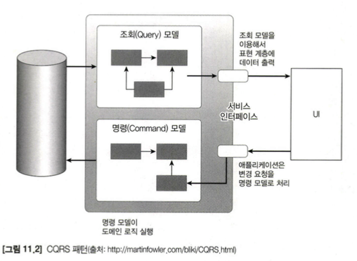
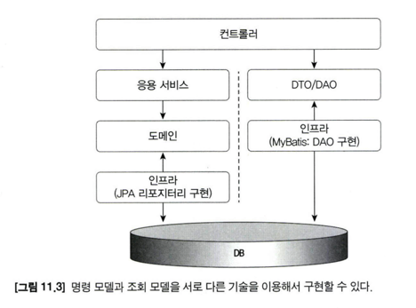
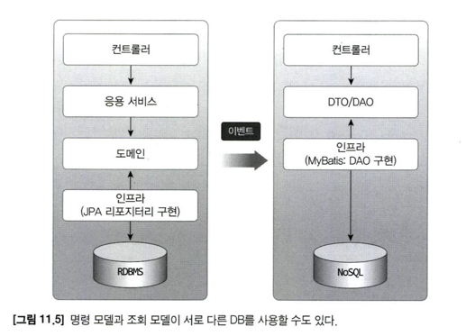

# 11. CQRS

## 11.1 단일 모델의 단점

식별자를 이용해서 애그리거트를 참조하는 방식을 사용하면 즉시 로딩과  
같은 JPA 의 쿼리 관련 최적화 기능을 사용할 수 없다.

애그리거트 간의 연관을 ID가 아니라 직접 참조하는 방식으로 연결해도 고민거리가 생긴다.

이런 고민이 발생하는 이유는 시스템의 상태를 변경할 때와  
조회할 때 단일 도메인 모델을 사용하기 때문이다.

구현 복잡도를 낮추기 위해, 상태 변경을 위한 모델과 조회르 위한 모델을 분리할 수 있다.

## 11.2 CQRS

상태 변경 범위와 상태 조회 범위가 정확하게 일치하지 않기 때문에  
단일 모델로 두 종류의 기능을 구현하면 모델이 불필요하게 복잡해진다.

CQRS 는 Command Query Responsibility Segregation 의 약자로   
상태를 변경하는 명령(Command)을 위한 모델과 상태를 제공하는 조회(Query)를 위한 모델을 분리하는 패턴이다.

CQRS 는 복잡한 도메인에 적합하다.

조회 모델에는 응용 서비스가 존재하지 않는다.

명령 모델과 조회 모델이 서로 다른 데이터 저장소를 사용할 수도 있다.  
이때 데이터 동기화는 이벤트를 활용해 처리한다.

명령 모델에서 상태를 변경하면 이벤트가 발생하고 그 이벤트를 조회 모델에  
전달해서 변경 내역을 반영하면 된다.

추가로 데이터 동기화 시점에 따라 구현 방식이 달라질 수도 있다.

- 실시간 동기화(동기 이벤트와 글로벌 트랜잭션 사용)
- 특정 시간 안에 동기화(비동기 이벤트)

### 11.2.1 웹과 CQRS

일반적으로 웹서비스는 상태 변경 요청보다 상태 조회 요청이 많다.

포털이나 대형 쇼핑몰과 같이 조회 기능 요청 비율이 높은 서비스는  
조회 성능을 높히기 위해 다양한 기법을 시도한다.

- 쿼리 최적화
- 캐시 적용
- 조회 전용 저장소 따로 사용

이는 결과 적으로 CQRS 를 적용하는것과 같은 효과를 만든다.  
대규모 트래픽이 발생하는 우베 서비스는 알게 모르게 CQRS 를 적용하게 된다.

조회 속도를 높히기 위해 별도 처리를 하고 있다면 명시적으로 명령 모델과  
조회 모델을 구분하자.

### 11.2.2 CQRS 장단점

#### 장점

- 명령 모델을 구현할 때 도메인 자체에 집중할 수 있다.
- 명령 모델에서 조회 관련 로직이 사라져 복잡도가 낮아진다.
- 조회 성능을 향상시키는데 유리하다.
  - 조회 단위로 캐시 기술을 적용할 수 있다.
  - 조회 전용 저장소를 사용하면 처리량을 대폭 늘릴 수도 있다.
- 조회 전용 모델을 사용하기 때문에 성능 향상을 위한 코드가 명령 모델에 영항을 주지 않는다.

#### 단점

- 구현해야 할 코드가 더 많아진다.
  - 도메인이 복잡하거나 트래픽이 많다면 조회 전용 모델을 만드는것이 유지 보수에 유리하지만  
    트래픽이 많지 않은 경우 얻을 이점이 있는지 따져봐야한다.
- 더 많은 기술이 필요하다
  - 명령 모델과 조회 모델을 다른 구현 기술을 사용하는 경우도 있고 서로 다른 저장소를 사용하기도 한다.

이러한 장단점을 고려해서 CQRS 패턴을 도입할지 여부를 결정해야 한다.
