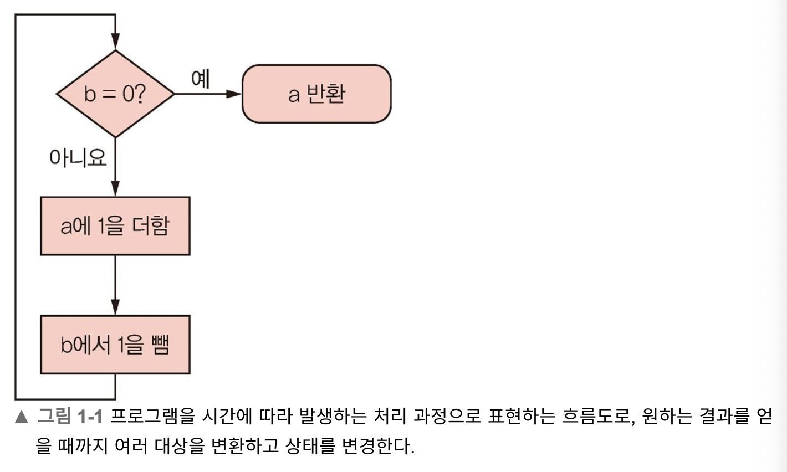
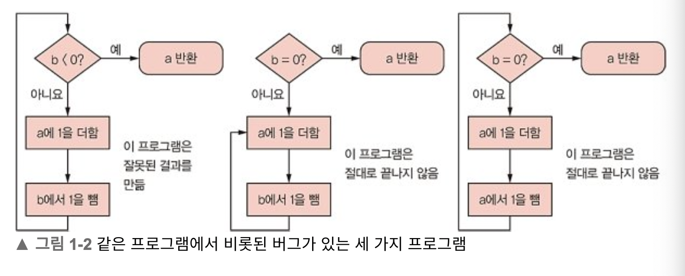
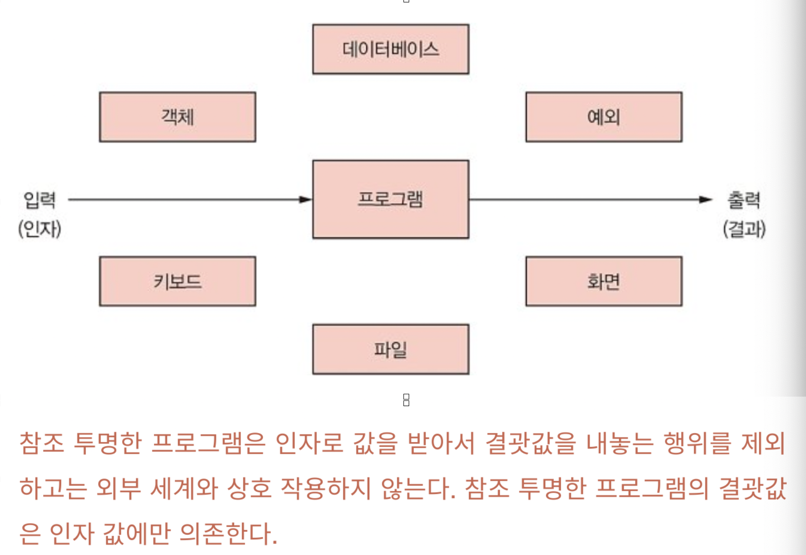

# 코틀린을 다루는 기술
## 프로그램을 더 안전하게 만들기

## 학습 목표

- 프로그래밍을 하다 빠지기 쉬운 함정 구별하기
- 부수 효과의 문제점 살펴보기
- 참조 투명성으로 프로그램을 더 안전하게 만들기
- 치환 모델로 프로그램 추론하기
- 추상화 최대한 활용하기

## 목차

1. [프로그램을 더 안전하게 만들기](#프로그램을-더-안전하게-만들기)
    - [프로그래밍의 함정](#프로그래밍의-함정)
        - [프로그램을 더 안전하게 만들기 위한 방법](#프로그램을-더-안전하게-만들기-위한-방법)
        - [안전하게 부수 효과 처리하기](#안전하게-부수-효과-처리하기)
        - [참조 투명성으로 프로그램을 더 안전하게 만들기](#참조-투명성으로-프로그램을-더-안전하게-만들기)
    - [안전한 프로그래밍의 이점](#안전한-프로그래밍의-이점)
        - [프로그램을 추론하는 데 치환 모델 사용하기](#프로그램을-추론하는-데-치환-모델-사용하기)
    - [요약](#요약)

## 프로그램을 더 안전하게 만들기

프로그램의 주된 위험은 프로그램에 숨어있는 버그다.

위험으로 부터 안전한 프로그램은 멱등성을 보장한다.

하지만 프로그램에서 버그를 완전히 없애지는 못한다. 버그에는 눈에 띄는 분명한 버그와 눈에 띄지 않는 불분명한 버그가 있다. 불문명한 버그는 나중에 분명한 버그로 자신을 드러낸다는 사실은 확실하다.

다만 분명한 버그로 자신을 드러낼때까지 얼마나 시간이 걸릴지가 문제일 뿐이다.

이 문제를 해결하기 위해선 버그가 없음이 명확히 보이는 단순한 프로그램을 작성해야 한다.

이 장의 나머지 부분에서는 프로그램을 더 안전하게 만들 수 있는 불변성(`immutability`), 참조 투명성(`referential transparency`), 치환 모델(`substitution model`)등을 설명하면서 몇 가지 권장할 만한 코딩 기법을 보여준다.

- 불변성(`immutability`)
- 참조 투명성(`referential transparency`)
- 치환 모델(`substitution model`)

## 프로그래밍의 함정

프로그램이 일련의 처리를 수행하는 과정을 묘사하는 기법이라고 생각하는 경우가 많다.

이런 묘사에는 문제를 해결하기 위해 프로그램이 사용하는 모델(model)에서 `상태를 변경하는 동작`과 모델의 상태 변이 결과에 대한 `의사결정`이 포함된다.

위 흐름도에서 데이터를 하나 변경하거나 화살표의 시작이나 끝 지점을 바꾸면 버그가 많은 프로그램이 된다.

이 문제를 막기 위해 쓸데없이 단순하기만 한 언어를 사용하는 것이 아니라 변경할 수 있는 참조나 언어가 허용하더라도 무조건 분기의 사용을 피하고 루프를 쓰지 않는 것이다.

- 비결은 단순한다. 상태 변이나 루프 같은 위험한 기능을 사용하지 말라.
- 만약 가변 참조나 루프가 필요한 경우가 생긴다면 그들을 추상화하라.
- 상태 변이를 추상화하는 컴포넌트를 단 한 번만 작성하라.
- 언어가 제공하는 기능 중 좋은 부분만 사용하라.

### 프로그램을 더 안전하게 만들기 위한 방법

버그를 자주 일으키는 다른 근원으로 널(Null) 참조가 있다.

코틀린을 사용하면 `널 참조를 허용하는 코드`와 `널 참조를 금지하는 코드`를 명확하게 분리할 수 있다.

프로그램을 더 안전하게 만들기 위한 방법은 다음과 같다.

- 가변 참조(변수) 사용을 피하고, 상태 변이를 피할 수 없는 경우에는 그 부분을 추상화하라.
- 제어 구조를 피하라
- 효과(effect, 외부 세계와의 상호 작용을 말한다!)는 작성하는 프로그램의 일부 영역 안에서만 일어나도록 제한하라.
    - 프로그램을 작성할 때 일부 한정된 영역을 제외한 나머지 부분에서 콘솔 등의 장치에 출력하거나 파일, 데이터베이스, 네트워크 등의 장치에 데이터를 쓰는 등의 행위를 하지 말아야 한다.
- 예외를 던지지 말라.
    - 예외를 던지는 것은 무조건 분기(GOTO)의 현대적인 변형이라 할 수 있다.
    - 이로 인해 프로그램이 스파게티 코드가 될 수 있다.

> 스파게티 코드란 프로그램 흐름이 어디서 시작하는지 알 수 있지만, 어디로 흘러가는지 제대로 따라갈 수 없다는 뜻이다.

### 안전하게 부수 효과 처리하기

`효과(effect)` 란 외부 세계와의 모든 상호 작용을 뜻한다.

> 콘솔에 메시지를 출력하거나 파일, 데이터베이스, 네트워크 등에 데이터를 쓰는 행위

일반적으로 프로그램은 자신만의 영역이 있는 작은 블록으로 이뤄진다.

어떤 언어는 이런 블록을 프러시저라고 부르고, 다른 언어는 메서드라고 부른다. 코틀린에서는 이런 블록을 `함수(function)`라 한다. (수학 함수와 같은 개념을 뜻하진 않는다.)

코틀린 함수는 기본적으로 메서드다. 메서드라는 코드 블록에는 `영역(scope)`이 있다.

**`영역`** 이란 말은 코드 블록 안에서 볼 수 있는 정의나 선언이 프로그램의 어떤 범위에 속하는지를 뜻한다. 블록은 그 자신이 둘러싸고 있는 영역을 볼 수 있을 뿐만 아니라 자신의 바깥쪽 영역을 볼 수 있고, 추이적(transitive) 으로 자신을 둘러싼 영역을 감싸는 더 바깥쪽 영역을 볼 수 있어서 최종적으로 가장 바깥 영역에 이르는 모든 영역을 볼 수 있다.

함수나 메서드가 외부 영역의 상태를 바꾸는 것이 바로 효과다.

> 예를 들어 메서드가 정의된 클래스는 메서드의 바깥 영역이다.

일부 메서드(함수)는 값을 반환한다. 일부 메서드는 클래스의 상태를 변경한다.

- 일부 메서드는 값을 반환하는 동시에 상태를 변경하기도 한다.
- 값을 반환하는 메서드나 함수가 외부 상태를 변경하는 경우 이를 `부수 효과(side effect)`라고 한다.

`부수 효과`를 사용하는 프로그램은 잘못된 것이다.

하지만 결과를 반환하지 않는 코드는 부수 효과를 기대할 수 없다. 반환하지 않는다는 것은 `상태 변화`가 주된 효과이기 때문에 이는 `이차적인 부수 효과`를 야기한다. 마찬가지로 이런 부수 효과도 SIP 원칙을 위반하기에 좋지 못한 기법이다.

### 참조 투명성으로 프로그램을 더 안전하게 만들기

부수 효과를 없애는 것(외부 세계를 변경하지 않는 것)만으로는 프로그램을 충분히 안전하고 결정적으로 만들 수 없다. 안전한 프로그램은 외부 세계로부터 영향을 받아서도 안 된다.

프로그램의 출력은 오직 그 인자에 의해서만 영향을 받아야 한다.

이는 프로그램이 데이터를 콘솔, 파일, 원격 URL, 데이터베이스에서 읽을 수 없음은 물론이고, 심지어 시스템의 데이터를 받을 수도 없다는 뜻이다.

외부 세계의 상태를 변경하지도 않고 외부 상태에 의존하지도 않는 코드를 일컬어 `참조 투명(referentially transparent)` 하다고 한다.

- 자기 완결적이다.
    - 어떤 문맥에서나 그 코드를 사용할 수 있다. 단지 올바른 인자를 그 코드에 제공하기만 하면 된다.
- 결정적이다.
    - 참조 투명한 코드는 멱등성을 보장한다.
    - 하지만 참조 투명한 코드도 잘못된 결괏값을 돌려줄 수는 있다.
    - 그렇지만 적어도 같은 인자에 대해 멱등성을 보장한다.
- 절대 예외를 던지지 않는다.
    - 다만 참조 투명한 코드도 메모리 부족 오류(OOME)나 스택 오버플로 오류(SOE)를 발생 시킬 수 는 있다.
    - 하지만 이런 오류는 프로그램에 버그가 있음을 뜻한다.
- 예기치 않게 다른 코드가 실패하는 상황을 만들지 않는다.
    - 참조 투명한 코드는 인자를 변경하거나 다른 외부 데이터를 변경하지 않으며, 그에 따라 코드를 호출하는 쪽의 데이터가 오염되거나 동시 접근으로 인해 오류가 발생하는 경우가 없다.
- 자신이 제대로 작동하기 위해 외부 장치에 의존하지 않는다.
    - 참조 투명한 코드는 외부 장치를 사용할 수 없거나, 외부 장치가 너무 느리거나 고장 나서 코드가 계속 대기 상태에 머무는 경우가 없다.

참조 투명한 프로그램은 인자로 값을 받아서 결괏값을 내놓는 행위를 제외하고는 외부 세계와 상호 작용하지 않는다.

참조 투명한 프로그램의 결괏값은 인자 값에만 의존한다.

## 안전한 프로그래밍의 이점

참조 투명성을 사용할 때 얻을 수 있는 다음과 같은 여러 이점을 생각할 수 있다.

- 프로그램이 결정적이기 때문에 프로그램을 추론하기 더 쉽다.
    - 입력이 같으면 항상 출력도 같다.
    - 예기치 않은 조건에서 깨질 수 있는지 확신할 수 없는 비 결정적인 프로그램과 달리 프로그램의 올바름을 증명할 수 있따.
- 더 쉽게 테스트할 수 있다.
    - 부수 효과가 없으므로 테스트하면서 프로그램 컴포넌트를 외부와 격리하기 위해 쓰는 목(mock)을 사용할 필요가 없다.
- 더 모듈활 할 수 있다.
    - 입력과 출력만 있는 함수로 프로그램을 구성하기 때문이다.
    - 부수 효과가 없으므로 일부러 처리하지 않아도 되고, 예외를 던지지 않으므로 굳이 잡아낼 필요가 없으며, 문맥 상태 변이가 없으므로 상태를 추적하느라 고민할 필요가 없고, 가변 상태를 공유하지 않으므로 동시 변경이 일어나지 않는다.
- 훨신 쉽게 합성하고 재조합할 수 있다.
    - 프로그램을 작성하려면 먼저 필요한 여러 기반 함수를 만들고, 그들을 합성해 더 높은 수준의 함수를 만들며, 원하는 프로그램에 해당하는 함수가 만들어질 때까지 이 과정을 반복한다.
    - 이 과정에서 모든 함수는 참조 투명하다.
    - 따라서 이 함수들을 변경하지 않고도 쉽게 다른 프로그램을 만들 때 재활용할 수 있다.
- 공유 상태 변이를 피하므로 프로그램이 태생적으로 스레드-안전하다.
    - 이 말이 모든 데이터가 불변이어야만 한다는 뜻은 아니다.
    - 다만 공유하려는 데이터는 모두 불변이어야 한다.

### 프로그램을 추론하는 데 치환 모델 사용하기

## 요약
